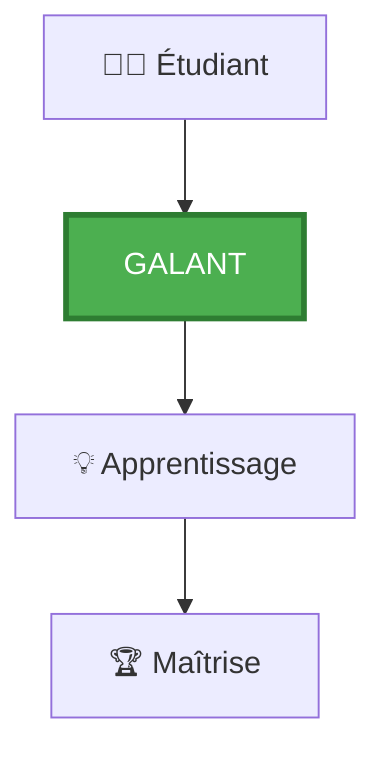
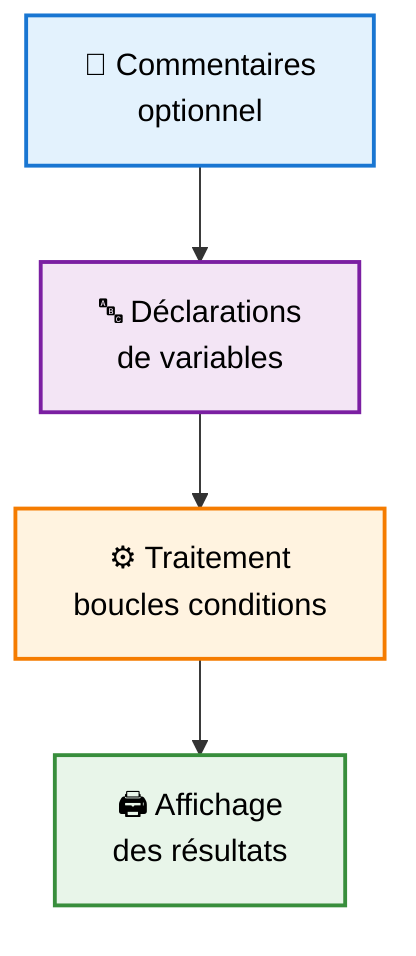
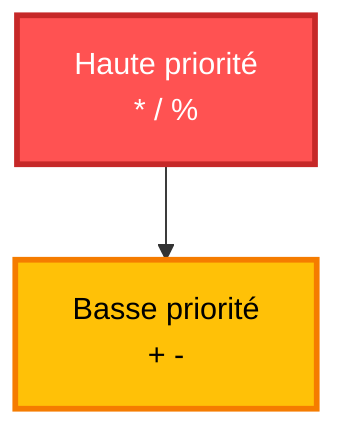
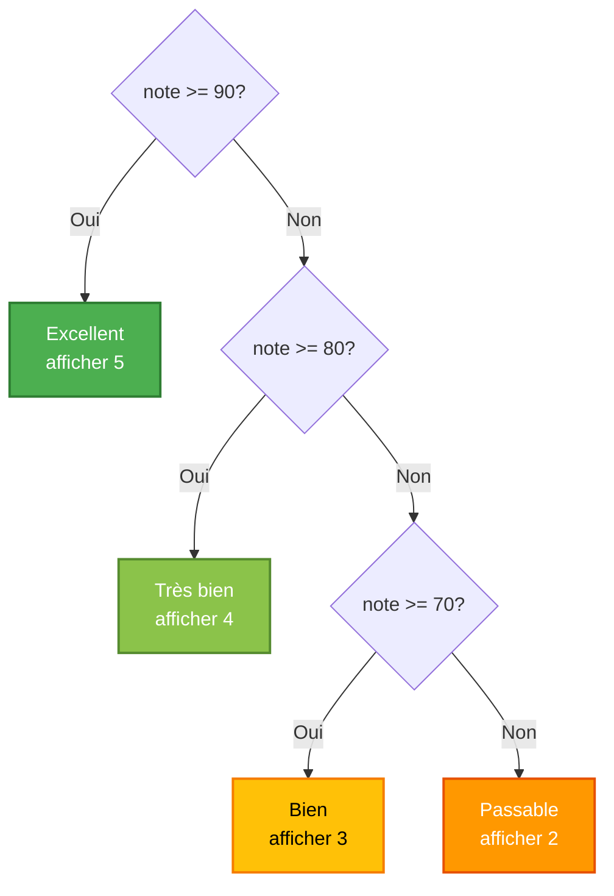
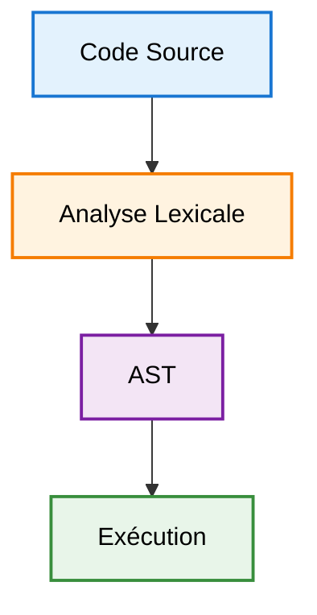
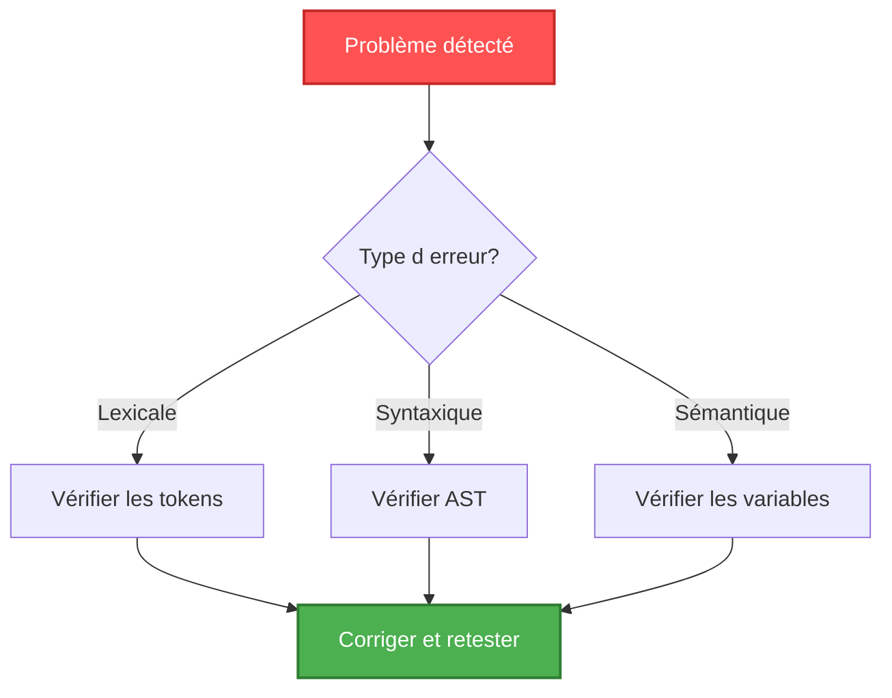

# 📚 Guide d'Utilisation Complet - GALANT

<div align="center">


[](.)
[](.)

*Guide complet pour maîtriser le langage GALANT* 🎓

</div>

---

## 📑 Table des Matières

| Section | Description |
|---------|-------------|
| [🎯 Introduction](#-introduction) | Qu'est-ce que GALANT ? |
| [💻 Installation](#-installation) | Guide d'installation complet |
| [🚀 Premiers Pas](#-premiers-pas) | Créer votre premier programme |
| [📖 Syntaxe Détaillée](#-syntaxe-détaillée) | Référence complète du langage |
| [💡 Exemples Avancés](#-exemples-avancés) | Programmes complexes |
| [🔍 Comprendre la Sortie](#-comprendre-la-sortie) | Interpréter les résultats |
| [🐛 Dépannage](#-dépannage) | Solutions aux problèmes courants |
| [✅ Bonnes Pratiques](#-bonnes-pratiques) | Code propre et maintenable |

---

## 🎯 Introduction

### Qu'est-ce que GALANT ?

<table>
<tr>
<td width="70%">

**GALANT** (GALe LANguage educaTif) est un compilateur minimaliste pour un langage de programmation **entièrement en français**.

#### 🎨 Vision
Permettre aux francophones d'apprendre la programmation et la compilation sans barrière linguistique.

</td>
<td width="30%">



</td>
</tr>
</table>

### 🌟 Caractéristiques Principales

| Caractéristique | Description | Avantage |
|----------------|-------------|----------|
| 📝 **Extension** | `.gal` | Format dédié et reconnaissable |
| 🇫🇷 **Langage** | Français uniquement | Pas de barrière linguistique |
| 🏗️ **Architecture** | Lexer → Parser → Sémantique | Comprendre la compilation |
| 🎓 **Objectif** | Apprentissage | Idéal pour les débutants |

### ❓ Pourquoi GALANT ?

```
┌─────────────────────────────────────────────────────────┐
│  ✅ Éducatif    │ Comprendre comment fonctionne un      │
│                 │ compilateur de A à Z                  │
├─────────────────────────────────────────────────────────┤
│  ✅ Simple      │ Syntaxe minimaliste et intuitive      │
│                 │ pour se concentrer sur l'essentiel    │
├─────────────────────────────────────────────────────────┤
│  ✅ Français    │ Pas de barrière linguistique pour     │
│                 │ les francophones                      │
├─────────────────────────────────────────────────────────┤
│  ✅ Complet     │ Toutes les phases de compilation      │
│                 │ implémentées                          │
└─────────────────────────────────────────────────────────┘
```

---

## 💻 Installation

### 📋 Prérequis

<details>
<summary><b>🔍 Vérifier les prérequis (cliquez pour développer)</b></summary>

#### Vérification GCC

```bash
gcc --version
```

**Sortie attendue :**
```
gcc (Ubuntu 9.4.0-1ubuntu1~20.04) 9.4.0
Copyright (C) 2019 Free Software Foundation, Inc.
```

#### Vérification Make

```bash
make --version
```

**Sortie attendue :**
```
GNU Make 4.2.1
Built for x86_64-pc-linux-gnu
```

</details>

### 🛠️ Installation des Outils

<table>
<tr>
<th>Système</th>
<th>Commande</th>
</tr>
<tr>
<td>🐧 <b>Linux (Ubuntu/Debian)</b></td>
<td>

```bash
sudo apt-get update
sudo apt-get install build-essential
```

</td>
</tr>
<tr>
<td>🍎 <b>macOS</b></td>
<td>

```bash
xcode-select --install
```

</td>
</tr>
<tr>
<td>🪟 <b>Windows</b></td>
<td>

Installer [MinGW](http://mingw.org/) ou utiliser [WSL](https://docs.microsoft.com/en-us/windows/wsl/)

</td>
</tr>
</table>

### ⚡ Étapes d'Installation

#### 📥 Étape 1 : Télécharger le projet

```bash
git clone https://github.com/Yahia995/galant-compiler
cd galant-compiler
```

#### 🔨 Étape 2 : Compiler le projet

```bash
make
```

**✅ Sortie attendue :**
```
  Compile: main.c
  Compile: lexer.c
  Compile: parser.c
  Compile: semantic.c
Compilation reussie. Executable: galant-compiler
```

#### 🎯 Étape 3 : Vérifier l'installation

```bash
# Linux/Mac
ls -la galant-compiler

# Windows
dir galant-compiler.exe
```

#### 🚀 Étape 4 : Premier test

```bash
./galant-compiler programme.gal
```

### 🎮 Commandes Make Utiles

| Commande | 🎯 Objectif | 📝 Description |
|----------|------------|---------------|
| `make` | Compiler | Compile tous les fichiers source |
| `make clean` | Nettoyer | Supprime les fichiers compilés |
| `make run` | Exécuter | Compile et exécute `programme.gal` |
| `make help` | Aide | Affiche toutes les commandes disponibles |

---

## 🚀 Premiers Pas

### 📝 Créer Votre Premier Programme

#### Étape 1️⃣ : Créer un fichier

Créez un fichier nommé `hello.gal` :

```galant
# Mon premier programme GALANT
variable message = 42;
afficher(message);
```

#### Étape 2️⃣ : Exécuter

```bash
./galant-compiler hello.gal
```

#### Étape 3️⃣ : Observer le résultat

```
=== Execution ===
42
```

### 🏗️ Comprendre la Structure



**Exemple de structure complète :**

```galant
# 1️⃣ Commentaires (optionnel)
# Description du programme

# 2️⃣ Déclarations de variables
variable x = 10;
variable y = 20;

# 3️⃣ Traitement (boucles, conditions)
tantque (x < y) {
  x = x + 1;
}

# 4️⃣ Affichage des résultats
afficher(x);
```

---

## 📖 Syntaxe Détaillée

### 1️⃣ Variables

#### 📌 Déclaration avec Initialisation

```galant
variable nom = valeur;
```

**💡 Exemples :**
```galant
variable age = 25;        # ✅ Entier positif
variable compteur = 0;    # ✅ Zéro
variable nombre = 100;    # ✅ Grand nombre
```

#### 📌 Déclaration sans Initialisation

```galant
variable nom;
```

> ⚠️ **Attention** : Utiliser une variable non initialisée provoque une erreur !

```
❌ Erreur semantique: variable 'nom' utilisee avant initialisation
```

#### 📌 Réaffectation

```galant
variable x = 10;    # Déclaration initiale
x = 20;             # ✅ Modification de la valeur
x = x + 5;          # ✅ Utilisation dans une expression
```

#### 📏 Règles de Nommage

<table>
<tr>
<th width="50%">✅ Autorisé</th>
<th width="50%">❌ Interdit</th>
</tr>
<tr>
<td>

**Caractères valides :**
- Lettres : `a-z`, `A-Z`
- Chiffres : `0-9` (pas en 1er)
- Underscore : `_`

**Exemples :**
```galant
variable nombre = 5;
variable nombre_total = 10;
variable compteur1 = 0;
variable _valeur = 100;
```

</td>
<td>

**Invalide :**
- Espaces
- Caractères spéciaux (sauf `_`)
- Mots-clés du langage
- Commencer par un chiffre

**Exemples :**
```galant
variable 1nombre = 5;     ❌
variable mon-nombre = 10; ❌
variable variable = 20;   ❌
variable mon nombre = 30; ❌
```

</td>
</tr>
</table>

---

### 2️⃣ Opérateurs Arithmétiques

#### ➕ Addition

```galant
variable a = 5;
variable b = 3;
variable somme = a + b;    # somme = 8
afficher(somme);
```

#### ➖ Soustraction

```galant
variable difference = 10 - 3;  # difference = 7
afficher(difference);
```

#### ✖️ Multiplication

```galant
variable produit = 4 * 5;      # produit = 20
afficher(produit);
```

#### ➗ Division Entière

```galant
variable quotient = 10 / 3;    # quotient = 3 (division entière)
afficher(quotient);
```

> ⚠️ **Division par zéro :**
> ```galant
> variable x = 10 / 0;
> # ❌ Erreur semantique: division par zero
> ```

#### 📐 Modulo (Reste)

```galant
variable reste = 10 % 3;       # reste = 1
afficher(reste);
```

#### 🎯 Priorité des Opérateurs



**Exemples :**

```galant
variable resultat = 2 + 3 * 4;  
# resultat = 14 (pas 20)
# Explication: 3 * 4 = 12, puis 2 + 12 = 14

variable avec_parentheses = (2 + 3) * 4;  
# avec_parentheses = 20
# Explication: 2 + 3 = 5, puis 5 * 4 = 20
```

---

### 3️⃣ Opérateurs de Comparaison

<table>
<tr>
<th>Opérateur</th>
<th>Signification</th>
<th>Exemple</th>
<th>Résultat (x=10)</th>
</tr>
<tr>
<td align="center"><code>==</code></td>
<td>Égal</td>
<td><code>x == 10</code></td>
<td>✅ Vrai (1)</td>
</tr>
<tr>
<td align="center"><code>!=</code></td>
<td>Différent</td>
<td><code>x != 5</code></td>
<td>✅ Vrai (1)</td>
</tr>
<tr>
<td align="center"><code>&gt;</code></td>
<td>Supérieur</td>
<td><code>x &gt; 5</code></td>
<td>✅ Vrai (1)</td>
</tr>
<tr>
<td align="center"><code>&lt;</code></td>
<td>Inférieur</td>
<td><code>x &lt; 20</code></td>
<td>✅ Vrai (1)</td>
</tr>
<tr>
<td align="center"><code>&gt;=</code></td>
<td>Supérieur ou égal</td>
<td><code>x &gt;= 10</code></td>
<td>✅ Vrai (1)</td>
</tr>
<tr>
<td align="center"><code>&lt;=</code></td>
<td>Inférieur ou égal</td>
<td><code>x &lt;= 15</code></td>
<td>✅ Vrai (1)</td>
</tr>
</table>

**💡 Exemple complet :**

```galant
variable x = 10;

si (x == 10) {
  afficher(1);    # ✅ S'exécute
}

si (x != 5) {
  afficher(2);    # ✅ S'exécute
}

si (x > 5) {
  afficher(3);    # ✅ S'exécute
}

si (x <= 20) {
  afficher(4);    # ✅ S'exécute
}
```

---

### 4️⃣ Structures de Contrôle

#### 🔀 Condition Simple (si)

```galant
si (condition) {
  # Instructions si la condition est vraie
}
```

**💡 Exemple :**
```galant
variable age = 18;

si (age >= 18) {
  afficher(1);    # ✅ Affiche 1 (majeur)
}
```

#### 🔀 Condition avec Alternative (si/sinon)

```galant
si (condition) {
  # Instructions si vraie
} sinon {
  # Instructions si fausse
}
```

**💡 Exemple :**
```galant
variable nombre = 7;

si (nombre % 2 == 0) {
  afficher(0);    # Pair
} sinon {
  afficher(1);    # ✅ Impair - s'exécute
}
```

#### 🔀 Conditions Imbriquées



**Code correspondant :**

```galant
variable note = 75;

si (note >= 90) {
  afficher(5);    # Excellent
} sinon {
  si (note >= 80) {
    afficher(4);  # Très bien
  } sinon {
    si (note >= 70) {
      afficher(3);  # ✅ Bien - s'exécute
    } sinon {
      afficher(2);  # Passable
    }
  }
}
```

---

### 5️⃣ Boucles (tantque)

#### 🔁 Syntaxe de Base

```galant
tantque (condition) {
  # Instructions à répéter
}
```

#### 🔁 Exemple Simple

```galant
variable i = 0;

tantque (i < 5) {
  afficher(i);
  i = i + 1;
}

# 📤 Affiche : 0, 1, 2, 3, 4
```

**📊 Flux d'exécution :**

```
┌─────────────────┐
│  i = 0          │ Initialisation
└────────┬────────┘
         │
    ┌────▼────┐
    │ i < 5?  │ Condition
    └─┬────┬──┘
      │Oui │Non
      │    │
      ▼    └────────┐
 ┌─────────┐        │
 │afficher │        │
 │i = i+1  │        │
 └────┬────┘        │
      │             │
      └─────────────┘
                    ▼
                 [FIN]
```

#### 🔁 Boucle de Comptage

```galant
variable compteur = 1;

tantque (compteur <= 10) {
  afficher(compteur);
  compteur = compteur + 1;
}

# 📤 Affiche les nombres de 1 à 10
```

#### 🔁 Boucles Imbriquées

```galant
variable i = 0;
variable j = 0;

tantque (i < 3) {
  j = 0;
  tantque (j < 2) {
    afficher(i * 10 + j);
    j = j + 1;
  }
  i = i + 1;
}

# 📤 Affiche : 0, 1, 10, 11, 20, 21
```

> ⚠️ **Attention aux boucles infinies !**
>
> ```galant
> variable x = 0;
> tantque (x < 10) {
>   afficher(x);
>   # ❌ ERREUR : x n'est jamais incrémenté !
>   # Boucle infinie ♾️
> }
> ```

---

### 6️⃣ Affichage

#### 🖨️ Afficher une Variable

```galant
variable x = 42;
afficher(x);      # 📤 Affiche : 42
```

#### 🖨️ Afficher une Expression

```galant
variable a = 5;
variable b = 3;
afficher(a + b);  # 📤 Affiche : 8
afficher(a * 2);  # 📤 Affiche : 10
```

#### 🖨️ Afficher un Nombre Littéral

```galant
afficher(100);    # 📤 Affiche : 100
afficher(0);      # 📤 Affiche : 0
```

#### 🖨️ Affichages Multiples

```galant
variable x = 10;
variable y = 20;
variable z = 30;

afficher(x);
afficher(y);
afficher(z);

# 📤 Affiche :
# 10
# 20
# 30
```

---

### 7️⃣ Commentaires

#### 💬 Commentaire sur une Ligne

```galant
# Ceci est un commentaire
variable x = 5;    # Commentaire en fin de ligne
```

#### 💬 Commentaires Multiples

```galant
# Première ligne de commentaire
# Deuxième ligne de commentaire
# Troisième ligne de commentaire
variable y = 10;
```

#### 💬 Bonnes Pratiques

```galant
# ============================================
# Programme : Calcul de factorielle
# Auteur : Votre Nom
# Date : 2024
# ============================================

# Initialisation des variables
variable n = 5;              # Nombre dont on calcule la factorielle
variable resultat = 1;       # Résultat final
variable i = 1;              # Compteur de boucle

# Calcul de la factorielle
tantque (i <= n) {
  resultat = resultat * i;
  i = i + 1;
}

# Affichage du résultat
afficher(resultat);
```

---

## 💡 Exemples Avancés

### 📊 Exemple 1 : Table de Multiplication

<details>
<summary><b>👁️ Voir le code et l'explication</b></summary>

```galant
# Table de multiplication par 7
variable i = 1;
variable resultat = 0;

tantque (i <= 10) {
  resultat = 7 * i;
  afficher(resultat);
  i = i + 1;
}
```

**📤 Sortie :**
```
7
14
21
28
35
42
49
56
63
70
```

**📝 Explication :**
- On initialise `i` à 1
- On calcule `7 * i` à chaque itération
- On affiche le résultat
- On incrémente `i`

</details>

### 🧮 Exemple 2 : Somme des N Premiers Entiers

<details>
<summary><b>👁️ Voir le code et l'explication</b></summary>

```galant
# Somme de 1 à 100
variable n = 100;
variable i = 1;
variable somme = 0;

tantque (i <= n) {
  somme = somme + i;
  i = i + 1;
}

afficher(somme);
```

**📤 Sortie :**
```
5050
```

**📝 Explication :**
- Formule : 1 + 2 + 3 + ... + 100
- À chaque tour, on ajoute `i` à `somme`
- Résultat : 5050

**💡 Astuce mathématique :**
La formule est : `n * (n + 1) / 2 = 100 * 101 / 2 = 5050`

</details>

### ⚡ Exemple 3 : Puissance

<details>
<summary><b>👁️ Voir le code et l'explication</b></summary>

```galant
# Calcul de 2^10
variable base = 2;
variable exposant = 10;
variable resultat = 1;
variable i = 0;

tantque (i < exposant) {
  resultat = resultat * base;
  i = i + 1;
}

afficher(resultat);
```

**📤 Sortie :**
```
1024
```

**📝 Explication :**
- On multiplie `resultat` par `base` 10 fois
- 2¹⁰ = 1024

</details>

### 🔢 Exemple 4 : Recherche de Maximum

<details>
<summary><b>👁️ Voir le code et l'explication</b></summary>

```galant
# Trouver le plus grand nombre entre trois valeurs
variable a = 45;
variable b = 67;
variable c = 23;
variable max = 0;

# Comparer a et b
si (a > b) {
  max = a;
} sinon {
  max = b;
}

# Comparer max avec c
si (c > max) {
  max = c;
}

afficher(max);
```

**📤 Sortie :**
```
67
```

**📝 Algorithme :**
1. Comparer `a` et `b`, garder le plus grand dans `max`
2. Comparer `max` avec `c`
3. Afficher le résultat

</details>

### 🔍 Exemple 5 : Test de Nombre Premier

<details>
<summary><b>👁️ Voir le code et l'explication</b></summary>

```galant
# Vérifier si 17 est premier
variable n = 17;
variable i = 2;
variable est_premier = 1;

tantque (i < n) {
  si (n % i == 0) {
    est_premier = 0;
  }
  i = i + 1;
}

afficher(est_premier);
```

**📤 Sortie :**
```
1  # Vrai, 17 est premier
```

**📝 Explication :**
- Si `n` est divisible par un nombre entre 2 et n-1, il n'est pas premier
- 17 n'est divisible par aucun nombre, donc premier

</details>

### 📈 Exemple 6 : Suite de Fibonacci

<details>
<summary><b>👁️ Voir le code et l'explication</b></summary>

```galant
# Les 10 premiers nombres de Fibonacci
variable n = 10;
variable i = 0;
variable a = 0;
variable b = 1;
variable temp = 0;

tantque (i < n) {
  afficher(a);
  temp = a + b;
  a = b;
  b = temp;
  i = i + 1;
}
```

**📤 Sortie :**
```
0
1
1
2
3
5
8
13
21
34
```

**📝 Algorithme :**
```
F(0) = 0
F(1) = 1
F(n) = F(n-1) + F(n-2)
```

</details>

---

## 🔍 Comprendre la Sortie

### 📊 Structure de la Sortie



### 1️⃣ Code Source

```
=== Code Source ===
variable x = 5;
afficher(x);
```

> 📄 Le code source tel qu'il est lu depuis le fichier `.gal`

### 2️⃣ Analyse Lexicale

```
=== Analyse Lexicale ===
[v0] Nombre de tokens: 7
[  0] MOT_CLE         = 'variable' (mot-cle: VARIABLE)
[  1] IDENTIFICATEUR  = 'x'
[  2] PONCTUATION     = '='
[  3] NOMBRE          = '5' (valeur: 5)
[  4] PONCTUATION     = ';'
[  5] MOT_CLE         = 'afficher' (mot-cle: AFFICHER)
[  6] PONCTUATION     = '('
...
```

**Détails :**
- 📝 Liste de tous les tokens (jetons) détectés
- 🏷️ Type de chaque token
- 💎 Valeur associée
- 📍 Position dans le code

### 3️⃣ Analyse Syntaxique (AST)

```
=== Analyse Syntaxique (AST) ===
PROGRAMME
  AFFECTATION [x]
    NOMBRE [5] (5)
  AFFICHAGE
    VARIABLE [x]
```

**Détails :**
- 🌳 Arbre de Syntaxe Abstraite (AST)
- 🏗️ Structure hiérarchique du programme
- 🔗 Relations entre les instructions

### 4️⃣ Exécution

```
=== Execution ===
5
```

> 🎯 Le résultat de l'exécution du programme

---

## 🐛 Dépannage

### ❌ Erreurs Courantes

#### 1️⃣ Fichier Non Trouvé

<details>
<summary><b>🔍 Voir la solution</b></summary>

**Erreur :**
```
Erreur: impossible d'ouvrir le fichier 'programme.gal'
```

**✅ Solutions :**
1. Vérifiez le nom du fichier
2. Vérifiez l'extension `.gal`
3. Vérifiez le chemin d'accès
4. Listez les fichiers : `ls` ou `dir`

**Exemple :**
```bash
# Vérifier que le fichier existe
ls *.gal

# Si le fichier est ailleurs
./galant-compiler chemin/vers/programme.gal
```

</details>

#### 2️⃣ Variable Non Déclarée

<details>
<summary><b>🔍 Voir la solution</b></summary>

**Erreur :**
```
Erreur semantique: variable 'x' non declaree
```

**❌ MAUVAIS :**
```galant
afficher(x);  # x n'existe pas
```

**✅ BON :**
```galant
variable x = 5;
afficher(x);
```

</details>

#### 3️⃣ Variable Non Initialisée

<details>
<summary><b>🔍 Voir la solution</b></summary>

**Erreur :**
```
Erreur semantique: variable 'x' utilisee avant initialisation
```

**❌ MAUVAIS :**
```galant
variable x;
afficher(x);  # x n'a pas de valeur
```

**✅ BON :**
```galant
variable x = 0;
afficher(x);
```

</details>

#### 4️⃣ Division par Zéro

<details>
<summary><b>🔍 Voir la solution</b></summary>

**Erreur :**
```
Erreur semantique: division par zero
```

**❌ MAUVAIS :**
```galant
variable x = 10 / 0;
```

**✅ BON :**
```galant
variable diviseur = 5;
si (diviseur != 0) {
  variable x = 10 / diviseur;
  afficher(x);
}
```

</details>

#### 5️⃣ Erreur de Syntaxe

<details>
<summary><b>🔍 Voir la solution</b></summary>

**Erreur :**
```
Erreur syntaxique a la ligne X
```

**Causes courantes :**

| Erreur | Exemple | Correction |
|--------|---------|------------|
| Oubli `;` | `variable x = 5` | `variable x = 5;` |
| Parenthèses | `si x > 0) {` | `si (x > 0) {` |
| Accolades | `tantque (i < 10) {` | Ajouter `}` à la fin |
| Orthographe | `varable x = 5;` | `variable x = 5;` |

</details>

---

## ✅ Bonnes Pratiques

### 1️⃣ Nommage des Variables

<table>
<tr>
<th>✅ Bon</th>
<th>❌ Mauvais</th>
</tr>
<tr>
<td>

```galant
variable nombre_etudiants = 25;
variable somme_totale = 1000;
variable compteur_iterations = 0;
```

**Pourquoi ?**
- Noms explicites
- Faciles à comprendre
- Auto-documentés

</td>
<td>

```galant
variable n = 25;
variable x = 1000;
variable i = 0;
```

**Problème :**
- Peu explicites
- Difficiles à maintenir
- Nécessitent des commentaires

</td>
</tr>
</table>

### 2️⃣ Indentation

<table>
<tr>
<th>✅ Bon</th>
<th>❌ Mauvais</th>
</tr>
<tr>
<td>

```galant
si (x > 0) {
  tantque (x < 10) {
    afficher(x);
    x = x + 1;
  }
}
```

**Pourquoi ?**
- Structure claire
- Facile à lire
- Blocs bien identifiés

</td>
<td>

```galant
si (x > 0) {
tantque (x < 10) {
afficher(x);
x = x + 1;
}
}
```

**Problème :**
- Structure confuse
- Difficile à lire
- Blocs mal délimités

</td>
</tr>
</table>

### 3️⃣ Commentaires

<table>
<tr>
<th>✅ Bon</th>
<th>❌ Mauvais</th>
</tr>
<tr>
<td>

```galant
# Calcul de la moyenne de trois notes
variable note1 = 15;
variable note2 = 18;
variable note3 = 12;
variable moyenne = (note1 + note2 + note3) / 3;
```

**Pourquoi ?**
- Explique l'intention
- Commentaire utile
- Code clair

</td>
<td>

```galant
variable n1 = 15;  # note 1
variable n2 = 18;  # note 2
variable n3 = 12;  # note 3
variable m = (n1 + n2 + n3) / 3;  # moyenne
```

**Problème :**
- Commentaires évidents
- Noms cryptiques
- Redondant

</td>
</tr>
</table>

### 4️⃣ Organisation du Code

```galant
# ====================================
# Programme : Calcul de somme
# Auteur : [Votre nom]
# Date : [Date]
# ====================================

# --- Déclarations ---
variable x = 0;
variable y = 0;
variable resultat = 0;

# --- Traitement principal ---
tantque (x < 10) {
  y = x * 2;
  resultat = resultat + y;
  x = x + 1;
}

# --- Affichage final ---
afficher(resultat);
```

### 5️⃣ Éviter les Boucles Infinies

| ✅ Bon | ❌ Mauvais |
|--------|-----------|
| `variable i = 0;`<br/>`tantque (i < 10) {`<br/>`  afficher(i);`<br/>`  i = i + 1;  # ✅ Incrémentation`<br/>`}` | `variable i = 0;`<br/>`tantque (i < 10) {`<br/>`  afficher(i);`<br/>`  # ❌ Oubli d'incrémentation`<br/>`}` |

---

## 📋 Template de Démarrage

```galant
# ============================================
# Nom du programme : [Votre titre]
# Description : [Ce que fait le programme]
# Auteur : [Votre nom]
# Date : [Date]
# ============================================

# --- Déclaration des variables ---
variable x = 0;
variable y = 0;
variable resultat = 0;

# --- Traitement principal ---
tantque (x < 10) {
  # Votre logique ici
  x = x + 1;
}

# --- Affichage des résultats ---
afficher(resultat);
```

---

## 📚 Ressources Supplémentaires

| 📄 Document | 📝 Description |
|------------|---------------|
| [README.md](README.md) | Vue d'ensemble du projet |
| [ARCHITECTURE.md](ARCHITECTURE.md) | Documentation technique détaillée |
| `exemples/` | Dossier avec programmes d'exemple |

---

## 🆘 Aide et Support

### 🛠️ Commandes Utiles

```bash
# Voir l'aide de Make
make help

# Nettoyer et recompiler
make clean && make

# Exécuter le programme par défaut
make run
```

### 🐛 Débogage



**Processus de débogage :**

1. 🔍 **Vérifiez la section "Analyse Lexicale"** pour voir si les tokens sont corrects
2. 🌳 **Vérifiez l'AST** pour voir si la structure est bonne
3. 📖 **Lisez les messages d'erreur** attentivement
4. 🧪 **Testez avec un programme simple** d'abord

---

<div align="center">

**Bon apprentissage avec GALANT ! 🚀📚**

[](README.md)
[](ARCHITECTURE.md)

---

*Fait avec ❤️ pour l'éducation en français* 🇫🇷

</div>
