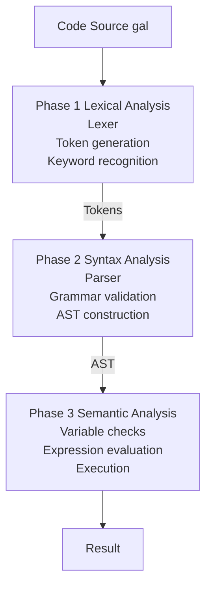
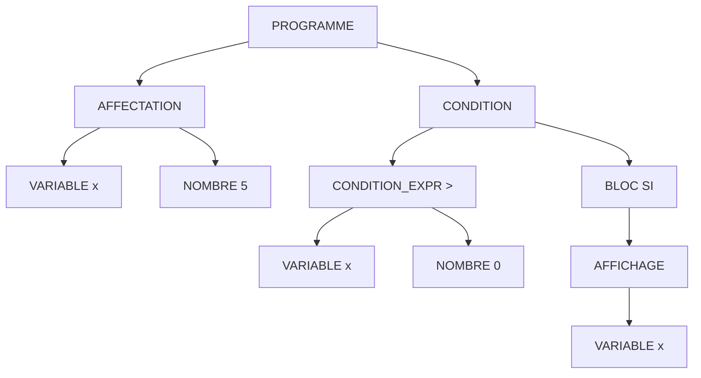
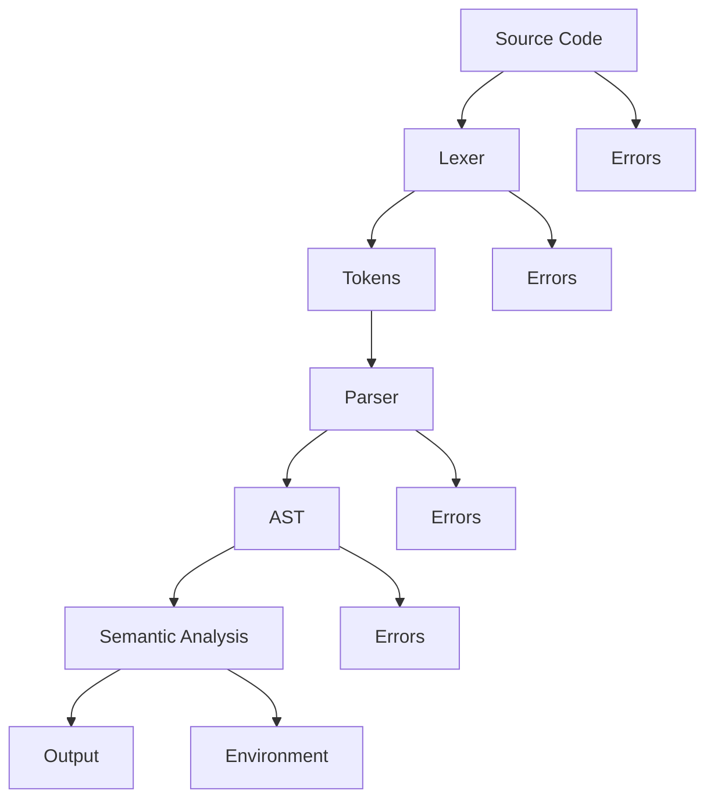
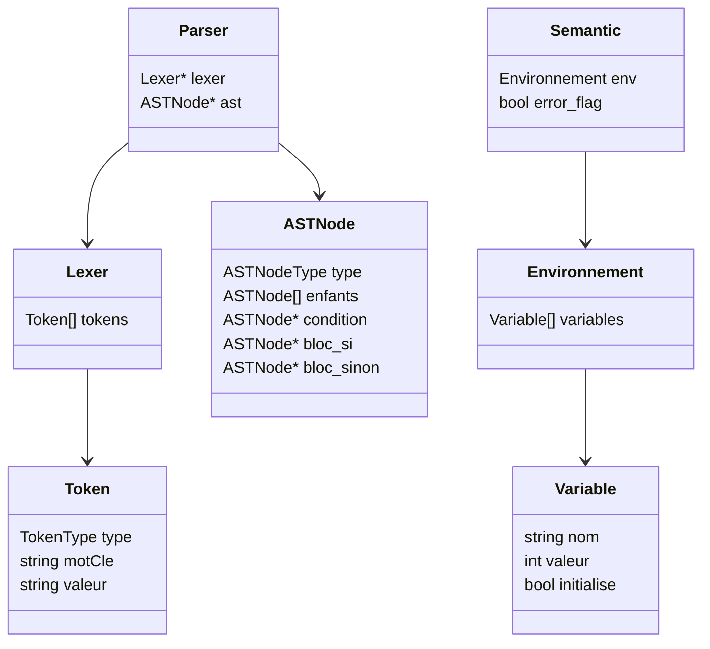

# 🧠 Architecture du Compilateur GALANT

> Documentation technique complète du compilateur éducatif GALANT

---

## Table des Matières

1. [Vue d'Ensemble](#vue-densemble)
2. [Phase 1 : Analyse Lexicale](#phase-1--analyse-lexicale)
3. [Phase 2 : Analyse Syntaxique](#phase-2--analyse-syntaxique)
4. [Phase 3 : Analyse Sémantique](#phase-3--analyse-sémantique)
5. [Module Principal](#module-principal)
6. [Gestion Mémoire](#gestion-mémoire)
7. [Gestion des Erreurs](#gestion-des-erreurs)
8. [Complexité et Performance](#complexité-et-performance)

---

## Vue d'Ensemble

### Architecture Globale



### Principes de Conception

1. **Modularité** - Chaque phase est indépendante
2. **Clarté** - Code lisible et bien commenté
3. **Robustesse** - Gestion complète des erreurs
4. **Éducatif** - Structure facile à comprendre

---

## Phase 1 : Analyse Lexicale

### Objectif

Transformer le code source en une séquence de **tokens** (jetons lexicaux).

### Fichiers

- `lexer.c` - Implémentation
- `lexer.h` - Interface et structures

### Structures de Données

#### Énumération TokenType

```c
typedef enum {
    TOKEN_NOMBRE,           // 42, 100, -5
    TOKEN_IDENTIFICATEUR,   // x, compteur, somme
    TOKEN_MOT_CLE,         // variable, si, tantque
    TOKEN_OPERATEUR_ARITH, // +, -, *, /, %
    TOKEN_OPERATEUR_COMP,  // ==, !=, >, <, >=, <=
    TOKEN_PONCTUATION,     // ;, (, ), {, }, =
    TOKEN_EOF,             // Fin de fichier
    TOKEN_ERREUR          // Token invalide
} TokenType;
```

#### Énumération MotCle

```c
typedef enum {
    KW_VARIABLE,  // variable
    KW_AFFICHER,  // afficher
    KW_SI,        // si
    KW_SINON,     // sinon
    KW_TANTQUE,   // tantque
    KW_NONE       // Pas un mot-clé
} MotCle;
```

#### Structure Token

```c
typedef struct {
    TokenType type;        // Type du token
    char* valeur;         // Texte du token
    int ligne;            // Numéro de ligne
    int colonne;          // Position dans la ligne
    MotCle mot_cle;       // Si c'est un mot-clé
    int valeur_nombre;    // Si c'est un nombre
} Token;
```

#### Structure Lexer

```c
typedef struct {
    const char* source;   // Code source
    size_t pos;          // Position actuelle
    int ligne;           // Ligne actuelle
    int colonne;         // Colonne actuelle
    Token* tokens;       // Tableau de tokens
    int nb_tokens;       // Nombre de tokens
    int capacite;        // Capacité du tableau
} Lexer;
```

### Fonctions Principales

#### 1. Création et Initialisation

```c
Lexer* lexer_creer(const char* source)
```

**Responsabilités :**
- Allouer la mémoire pour le lexer
- Initialiser la position à 0
- Créer le tableau de tokens (capacité initiale : 100)

**Complexité :** O(1)

#### 2. Analyse Lexicale

```c
void lexer_analyser(Lexer* lexer)
```

**Algorithme :**

```
TANT QUE pas fin du fichier :
    caractère ← lire_caractère()
    
    SI caractère est un espace ou \n :
        ignorer et continuer
    
    SINON SI caractère est '#' :
        ignorer jusqu'à fin de ligne (commentaire)
    
    SINON SI caractère est un chiffre :
        lire_nombre()
    
    SINON SI caractère est une lettre :
        lire_identificateur()
        vérifier si c'est un mot-clé
    
    SINON SI caractère est un opérateur (+, -, *, /, %, etc.) :
        lire_operateur()
        gérer les opérateurs doubles (==, !=, <=, >=)
    
    SINON SI caractère est une ponctuation :
        créer token de ponctuation
    
    SINON :
        créer TOKEN_ERREUR

AJOUTER TOKEN_EOF à la fin
```

**Complexité :** O(n) où n = longueur du code source

#### 3. Fonctions Auxiliaires

```c
static char lexer_peek(Lexer* lexer)
```
- Regarde le caractère actuel sans avancer

```c
static char lexer_peek_next(Lexer* lexer)
```
- Regarde le caractère suivant

```c
static void lexer_lire_nombre(Lexer* lexer, Token* token)
```
- Lit une séquence de chiffres
- Convertit en entier avec `atoi()`

```c
static void lexer_lire_identificateur(Lexer* lexer, Token* token)
```
- Lit lettres, chiffres et underscores
- Vérifie si c'est un mot-clé

```c
static MotCle lexer_est_mot_cle(const char* str)
```
- Compare avec les mots-clés du langage
- Retourne `KW_NONE` si ce n'est pas un mot-clé

### Exemple de Tokenization

**Entrée :**
```galant
variable x = 5;
```

**Sortie (Tokens) :**
```
[0] TOKEN_MOT_CLE        = "variable" (KW_VARIABLE)
[1] TOKEN_IDENTIFICATEUR = "x"
[2] TOKEN_PONCTUATION    = "="
[3] TOKEN_NOMBRE         = "5" (valeur: 5)
[4] TOKEN_PONCTUATION    = ";"
[5] TOKEN_EOF            = ""
```

### Gestion des Erreurs

- **Caractère invalide** → `TOKEN_ERREUR`
- **Nombre mal formé** → Continue avec ce qui a été lu
- **Chaîne non fermée** → Pas supporté dans GALANT

---

## Phase 2 : Analyse Syntaxique

### Objectif

Construire un **Arbre de Syntaxe Abstraite (AST)** représentant la structure du programme.

### Fichiers

- `parser.c` - Implémentation
- `parser.h` - Interface et structures

### Structures de Données

#### Énumération ASTNodeType

```c
typedef enum {
    AST_PROGRAMME,       // Nœud racine
    AST_AFFECTATION,     // x = expr
    AST_AFFICHAGE,       // afficher(expr)
    AST_CONDITION,       // si (cond) {...} sinon {...}
    AST_BOUCLE,          // tantque (cond) {...}
    AST_BLOC,            // { instructions }
    AST_EXPRESSION,      // Expression générique
    AST_NOMBRE,          // 42
    AST_VARIABLE,        // x
    AST_OPERATEUR,       // +, -, *, /, %
    AST_CONDITION_EXPR   // ==, !=, >, <, >=, <=
} ASTNodeType;
```

#### Structure ASTNode

```c
typedef struct ASTNode {
    ASTNodeType type;              // Type du nœud
    char* valeur;                  // Valeur (nom variable, opérateur)
    int nombre;                    // Valeur numérique
    struct ASTNode** enfants;      // Tableau d'enfants
    int nb_enfants;                // Nombre d'enfants
    int capacite;                  // Capacité du tableau
    struct ASTNode* condition;     // Condition (pour si/tantque)
    struct ASTNode* bloc_si;       // Bloc si vrai
    struct ASTNode* bloc_sinon;    // Bloc si faux
} ASTNode;
```

#### Structure Parser

```c
typedef struct {
    Lexer* lexer;    // Référence au lexer
    int pos;         // Position dans les tokens
} Parser;
```

### Grammaire du Langage

#### Notation EBNF

```ebnf
programme        ::= { instruction }

instruction      ::= affectation 
                   | affichage 
                   | condition 
                   | boucle

affectation      ::= "variable" IDENTIFICATEUR ["=" expression] ";"
                   | IDENTIFICATEUR "=" expression ";"

affichage        ::= "afficher" "(" expression ")" ";"

condition        ::= "si" "(" condition_expr ")" bloc 
                     ["sinon" bloc]

boucle           ::= "tantque" "(" condition_expr ")" bloc

bloc             ::= "{" { instruction } "}"

condition_expr   ::= expression operateur_comp expression

expression       ::= terme { ("+" | "-") terme }

terme            ::= facteur { ("*" | "/" | "%") facteur }

facteur          ::= NOMBRE 
                   | IDENTIFICATEUR 
                   | "(" expression ")"

operateur_comp   ::= "==" | "!=" | ">" | "<" | ">=" | "<="
```

### Fonctions Principales

#### 1. Création du Parser

```c
Parser* parser_creer(Lexer* lexer)
```

**Responsabilités :**
- Allouer le parser
- Initialiser la position à 0

#### 2. Analyse Syntaxique

```c
ASTNode* parser_analyser(Parser* parser)
```

**Algorithme :**

```
créer nœud PROGRAMME
TANT QUE token actuel != EOF :
    instruction ← parser_instruction()
    ajouter instruction au programme
RETOURNER programme
```

#### 3. Parsing d'Instructions

```c
static ASTNode* parser_instruction(Parser* parser)
```

**Analyse par cas :**

1. **TOKEN_MOT_CLE = "variable"**
   ```
   consommer "variable"
   lire IDENTIFICATEUR
   SI token = "=" :
       consommer "="
       expr ← parser_expression()
       créer AFFECTATION avec expr
   SINON :
       créer AFFECTATION sans enfants (déclaration)
   consommer ";"
   ```

2. **TOKEN_MOT_CLE = "afficher"**
   ```
   consommer "afficher"
   consommer "("
   expr ← parser_expression()
   consommer ")"
   consommer ";"
   créer AFFICHAGE avec expr
   ```

3. **TOKEN_MOT_CLE = "si"**
   ```
   consommer "si"
   consommer "("
   cond ← parser_condition()
   consommer ")"
   bloc_si ← parser_bloc()
   SI token = "sinon" :
       consommer "sinon"
       bloc_sinon ← parser_bloc()
   créer CONDITION avec cond, bloc_si, bloc_sinon
   ```

4. **TOKEN_MOT_CLE = "tantque"**
   ```
   consommer "tantque"
   consommer "("
   cond ← parser_condition()
   consommer ")"
   bloc ← parser_bloc()
   créer BOUCLE avec cond, bloc
   ```

#### 4. Parsing d'Expressions

```c
static ASTNode* parser_expression(Parser* parser)
```

**Algorithme (descente récursive) :**

```
gauche ← parser_terme()
TANT QUE token est "+" ou "-" :
    op ← consommer opérateur
    droite ← parser_terme()
    créer nœud OPERATEUR(op, gauche, droite)
    gauche ← nouveau nœud
RETOURNER gauche
```

```c
static ASTNode* parser_terme(Parser* parser)
```

```
gauche ← parser_facteur()
TANT QUE token est "*", "/" ou "%" :
    op ← consommer opérateur
    droite ← parser_facteur()
    créer nœud OPERATEUR(op, gauche, droite)
    gauche ← nouveau nœud
RETOURNER gauche
```

```c
static ASTNode* parser_facteur(Parser* parser)
```

```
SI token = NOMBRE :
    créer nœud NOMBRE
SINON SI token = IDENTIFICATEUR :
    créer nœud VARIABLE
SINON SI token = "(" :
    consommer "("
    expr ← parser_expression()
    consommer ")"
    RETOURNER expr
```

### Exemple d'AST

**Code :**
```galant
variable x = 5;
si (x > 0) {
  afficher(x);
}
```

**AST :**


### Gestion des Erreurs

- **Token inattendu** → Message d'erreur avec position
- **Parenthèse non fermée** → Détecté lors du parsing
- **Instruction incomplète** → Signalée

---

## Phase 3 : Analyse Sémantique

### Objectif

Vérifier la **cohérence sémantique** et **exécuter** le programme.

### Fichiers

- `semantic.c` - Implémentation
- `semantic.h` - Interface et structures

### Structures de Données

#### Structure Variable

```c
typedef struct {
    char* nom;          // Nom de la variable
    int valeur;         // Valeur actuelle
    int initialise;     // 0 = non initialisée, 1 = initialisée
} Variable;
```

#### Structure Environnement

```c
#define MAX_VARIABLES 1000

typedef struct {
    Variable variables[MAX_VARIABLES];  // Tableau de variables
    int nb_variables;                   // Nombre de variables
} Environnement;
```

### Fonctions Principales

#### 1. Création de l'Environnement

```c
Environnement* semantic_creer_env(void)
```

**Responsabilités :**
- Allouer l'environnement
- Initialiser nb_variables à 0
- Réinitialiser le flag d'erreur global

#### 2. Gestion des Variables

```c
Variable* semantic_trouver_variable(Environnement* env, const char* nom)
```

**Algorithme :**
```
POUR chaque variable dans l'environnement :
    SI variable.nom == nom :
        RETOURNER pointeur vers variable
RETOURNER NULL
```

**Complexité :** O(n) où n = nombre de variables

```c
void semantic_definir_variable(Environnement* env, const char* nom, int valeur)
```

**Algorithme :**
```
var ← trouver_variable(nom)
SI var existe :
    var.valeur ← valeur
    var.initialise ← 1
SINON :
    créer nouvelle variable
    ajouter à l'environnement
```

```c
void semantic_declarer_variable(Environnement* env, const char* nom)
```

**Algorithme :**
```
SI variable existe déjà :
    RETOURNER
créer nouvelle variable
    nom ← nom
    valeur ← 0
    initialise ← 0
ajouter à l'environnement
```

#### 3. Évaluation d'Expressions

```c
static int evaluer_expression(Environnement* env, ASTNode* node)
```

**Algorithme (récursif) :**

```
SI node est NOMBRE :
    RETOURNER node.nombre

SI node est VARIABLE :
    var ← trouver_variable(node.valeur)
    SI var n'existe pas :
        ERREUR: variable non déclarée
    SI var.initialise == 0 :
        ERREUR: variable non initialisée
    RETOURNER var.valeur

SI node est OPERATEUR :
    gauche ← evaluer_expression(node.enfants[0])
    droite ← evaluer_expression(node.enfants[1])
    
    SELON node.valeur :
        "+": RETOURNER gauche + droite
        "-": RETOURNER gauche - droite
        "*": RETOURNER gauche * droite
        "/": 
            SI droite == 0 :
                ERREUR: division par zéro
            RETOURNER gauche / droite
        "%": 
            SI droite == 0 :
                ERREUR: modulo par zéro
            RETOURNER gauche % droite

SI node est CONDITION_EXPR :
    gauche ← evaluer_expression(node.enfants[0])
    droite ← evaluer_expression(node.enfants[1])
    
    SELON node.valeur :
        "==": RETOURNER gauche == droite
        "!=": RETOURNER gauche != droite
        ">":  RETOURNER gauche > droite
        "<":  RETOURNER gauche < droite
        ">=": RETOURNER gauche >= droite
        "<=": RETOURNER gauche <= droite
```

**Complexité :** O(profondeur de l'arbre)

#### 4. Exécution du Programme

```c
static void executer_noeud(Environnement* env, ASTNode* node)
```

**Algorithme (récursif) :**

```
SI error_flag est activé :
    RETOURNER (arrêt sur erreur)

SELON node.type :
    
    PROGRAMME ou BLOC :
        POUR chaque enfant :
            executer_noeud(enfant)
            SI erreur : RETOURNER
    
    AFFECTATION :
        SI nb_enfants == 0 :
            # Déclaration sans initialisation
            declarer_variable(node.valeur)
        SINON :
            # Déclaration avec initialisation ou réaffectation
            valeur ← evaluer_expression(node.enfants[0])
            definir_variable(node.valeur, valeur)
    
    AFFICHAGE :
        valeur ← evaluer_expression(node.enfants[0])
        SI pas d'erreur :
            AFFICHER valeur
    
    CONDITION :
        condition ← evaluer_expression(node.condition)
        SI condition est vraie :
            executer_noeud(node.bloc_si)
        SINON SI node.bloc_sinon existe :
            executer_noeud(node.bloc_sinon)
    
    BOUCLE :
        TANT QUE evaluer_expression(node.condition) ET pas d'erreur :
            executer_noeud(node.bloc_si)
```

### Vérifications Sémantiques

#### 1. Variables Non Déclarées

```c
if (!var) {
    fprintf(stderr, "Erreur semantique: variable '%s' non declaree\n", nom);
    error_flag = 1;
    return 0;
}
```

#### 2. Variables Non Initialisées

```c
if (!var->initialise) {
    fprintf(stderr, "Erreur semantique: variable '%s' utilisee avant initialisation\n", nom);
    error_flag = 1;
    return 0;
}
```

#### 3. Division par Zéro

```c
if (droit == 0) {
    fprintf(stderr, "Erreur semantique: division par zero\n");
    error_flag = 1;
    return 0;
}
```

### Gestion du Flag d'Erreur

```c
static int error_flag = 0;  // Variable globale
```

- **Initialisé à 0** au début de l'exécution
- **Mis à 1** lors d'une erreur
- **Vérifié** avant chaque opération
- **Arrête** l'exécution si activé

---

## Module Principal

### Fichier

- `main.c` - Point d'entrée du compilateur

### Fonction Principale

```c
int main(int argc, char* argv[])
```

### Flux d'Exécution

```c
// 1. Vérification des arguments
if (argc < 2) {
    fprintf(stderr, "Usage: %s <fichier.gal>\n", argv[0]);
    return 1;
}

// 2. Lecture du fichier
char* source = lire_fichier(argv[1]);

// 3. Affichage du code source
printf("=== Code Source ===\n%s\n", source);

// 4. Phase Lexicale
Lexer* lexer = lexer_creer(source);
lexer_analyser(lexer);
lexer_afficher_tokens(lexer);

// 5. Phase Syntaxique
Parser* parser = parser_creer(lexer);
ASTNode* ast = parser_analyser(parser);
parser_afficher_ast(ast, 0);

// 6. Phase Sémantique
Environnement* env = semantic_creer_env();
semantic_executer(env, ast);

// 7. Libération mémoire
semantic_liberer_env(env);
parser_liberer_ast(ast);
parser_liberer(parser);
lexer_liberer(lexer);
free(source);
```

### Fonction de Lecture de Fichier

```c
char* lire_fichier(const char* nom_fichier)
```

**Algorithme :**
```
ouvrir fichier en mode lecture binaire
SI échec : retourner NULL

déplacer curseur à la fin
taille ← position du curseur
revenir au début

allouer mémoire (taille + 1)
lire contenu dans buffer
buffer[taille] ← '\0'

fermer fichier
RETOURNER buffer
```

---

## Gestion Mémoire

### Stratégie Générale

- **Allocation dynamique** pour flexibilité
- **Libération explicite** pour éviter les fuites
- **Doublement de capacité** pour les tableaux dynamiques

### Par Module

#### Lexer

```c
// Allocation
lexer->tokens = malloc(100 * sizeof(Token));

// Expansion
if (lexer->nb_tokens >= lexer->capacite) {
    lexer->capacite *= 2;
    lexer->tokens = realloc(lexer->tokens, ...);
}

// Libération
for (int i = 0; i < lexer->nb_tokens; i++) {
    free(lexer->tokens[i].valeur);
}
free(lexer->tokens);
free(lexer);
```

#### Parser

```c
// Allocation des enfants
node->enfants = malloc(10 * sizeof(ASTNode*));

// Expansion
if (node->nb_enfants >= node->capacite) {
    node->capacite *= 2;
    node->enfants = realloc(node->enfants, ...);
}

// Libération (récursive)
void parser_liberer_ast(ASTNode* node) {
    for (int i = 0; i < node->nb_enfants; i++) {
        parser_liberer_ast(node->enfants[i]);
    }
    free(node->valeur);
    free(node->enfants);
    free(node);
}
```

#### Semantic

```c
// Environnement : tableau fixe
Variable variables[MAX_VARIABLES];

// Libération
for (int i = 0; i < env->nb_variables; i++) {
    free(env->variables[i].nom);
}
free(env);
```

### Prévention des Fuites

- **Ordre de libération** : enfants avant parents
- **Vérification NULL** avant free
- **Pas de double free**

---

## Gestion des Erreurs

### Types d'Erreurs

| Type | Phase | Exemple |
|------|-------|---------|
| **Lexicale** | Lexer | Caractère invalide `@` |
| **Syntaxique** | Parser | `variable x` (manque `;`) |
| **Sémantique** | Semantic | Variable non déclarée |

### Mécanisme d'Erreur

#### Flag Global

```c
static int error_flag = 0;
```

- **Activé** lors d'une erreur
- **Vérifié** avant chaque opération critique
- **Arrête l'exécution** si activé

#### Affichage des Erreurs

```c
fprintf(stderr, "Erreur semantique: %s\n", message);
fflush(stderr);  // Forcer l'affichage immédiat
```

#### Propagation

```c
if (error_flag) return;  // Dans executer_noeud()
```

### Messages d'Erreur

- **Clairs** et **précis**
- **Ligne et colonne** (quand disponible)
- **Suggestion** de correction (quand possible)

---

## Complexité et Performance

### Analyse de Complexité

| Phase | Complexité Temporelle | Complexité Spatiale |
|-------|----------------------|---------------------|
| **Lexer** | O(n) | O(n) |
| **Parser** | O(m) | O(m) |
| **Semantic** | O(itérations × profondeur AST) | O(variables) |

Où :
- n = longueur du code source
- m = nombre de tokens
- variables = nombre de variables déclarées

### Optimisations Possibles

1. **Table de hachage** pour les variables (O(1) au lieu de O(n))
2. **Pool de mémoire** pour les nœuds AST
3. **Compilation JIT** au lieu d'interprétation
4. **Cache des expressions constantes**

### Limitations Actuelles

- **MAX_VARIABLES** = 1000 (tableau fixe)
- **Recherche linéaire** dans l'environnement
- **Pas d'optimisation** de l'AST
- **Interprétation** pure (pas de compilation)

---

## Technologies Utilisées

- **Langage** : C (C99 standard)
- **Compilateur** : GCC
- **Build System** : Make
- **Plateforme** : Linux, Windows (via MinGW), macOS

---

## Diagrammes Détaillés

### Flux de Données



### Hiérarchie des Structures



---

## Conclusion

L'architecture de GALANT suit les principes classiques de construction de compilateur tout en restant simple et éducative. Chaque phase est clairement séparée, facilitant la compréhension et la maintenance.

---

**Pour plus d'informations, consultez :**
- `README.md` - Vue d'ensemble
- `GUIDE_UTILISATION.md` - Guide utilisateur complet
