# 🧠 Architecture du Compilateur GALANT

<div align="center">


[-green?style=for-the-badge)](.)
[](.)

*Documentation technique complète du compilateur éducatif GALANT*

</div>

---

## 📑 Table des Matières

| 🔷 Section | 📝 Description |
|-----------|---------------|
| [🌐 Vue d'Ensemble](#-vue-densemble) | Architecture globale |
| [🔍 Phase 1 : Lexer](#-phase-1--analyse-lexicale) | Analyse lexicale (tokens) |
| [🌳 Phase 2 : Parser](#-phase-2--analyse-syntaxique) | Analyse syntaxique (AST) |
| [✅ Phase 3 : Semantic](#-phase-3--analyse-sémantique) | Analyse sémantique et exécution |
| [🎯 Module Principal](#-module-principal) | Point d'entrée (main.c) |
| [💾 Gestion Mémoire](#-gestion-mémoire) | Allocation et libération |
| [🐛 Gestion des Erreurs](#-gestion-des-erreurs) | Détection et traitement |
| [📊 Performance](#-complexité-et-performance) | Analyse de complexité |

---

## 🌐 Vue d'Ensemble

### 🏗️ Architecture Globale

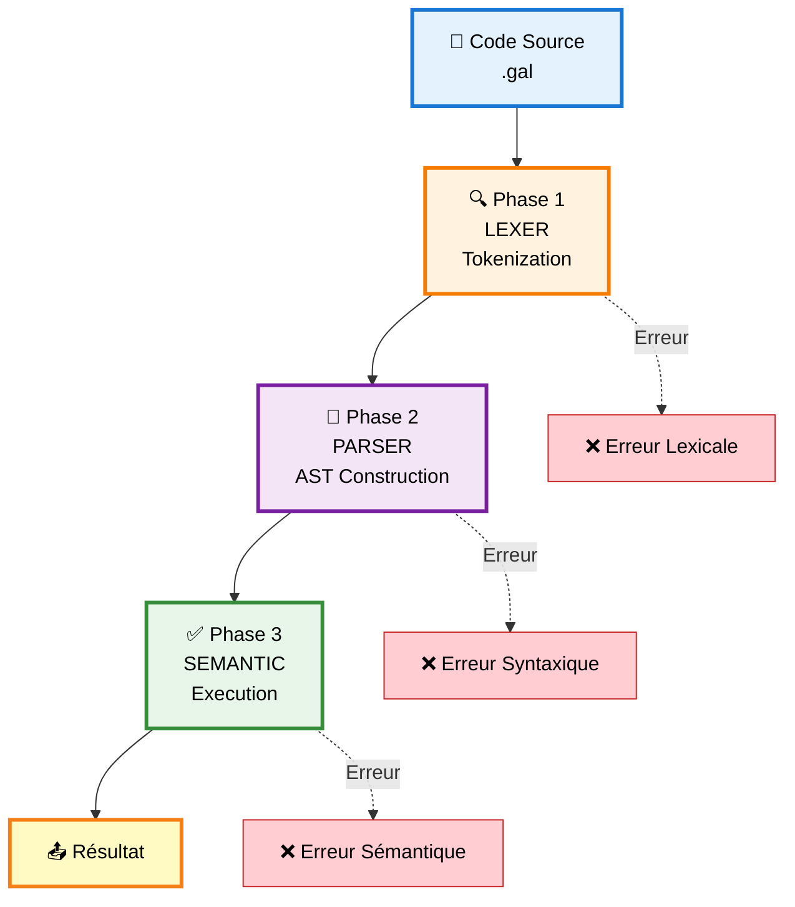

### 🎯 Principes de Conception

<table>
<tr>
<td width="50%">

#### 🧩 Modularité
- Chaque phase est indépendante
- Interfaces claires entre modules
- Facilite la maintenance et l'évolution

</td>
<td width="50%">

#### 🔬 Clarté
- Code lisible et bien commenté
- Nommage explicite
- Documentation intégrée

</td>
</tr>
<tr>
<td width="50%">

#### 🛡️ Robustesse
- Gestion complète des erreurs
- Validation à chaque étape
- Messages d'erreur informatifs

</td>
<td width="50%">

#### 🎓 Éducatif
- Structure facile à comprendre
- Commentaires pédagogiques
- Exemples intégrés

</td>
</tr>
</table>

---

## 🔍 Phase 1 : Analyse Lexicale

### 🎯 Objectif

> Transformer le code source en une séquence de **tokens** (jetons lexicaux)

### 📁 Fichiers

| Fichier | Rôle |
|---------|------|
| `lexer.c` | 🔧 Implémentation |
| `lexer.h` | 📋 Interface et structures |

### 🏗️ Structures de Données

#### 1️⃣ TokenType - Types de Tokens

```c
typedef enum {
    TOKEN_NOMBRE,           // 42, 100, -5
    TOKEN_IDENTIFICATEUR,   // x, compteur, somme
    TOKEN_MOT_CLE,         // variable, si, tantque
    TOKEN_OPERATEUR_ARITH, // +, -, *, /, %
    TOKEN_OPERATEUR_COMP,  // ==, !=, >, <, >=, <=
    TOKEN_PONCTUATION,     // ;, (, ), {, }, =
    TOKEN_EOF,             // Fin de fichier
    TOKEN_ERREUR          // Token invalide
} TokenType;
```

#### 2️⃣ MotCle - Mots-clés du Langage

```c
typedef enum {
    KW_VARIABLE,  // variable
    KW_AFFICHER,  // afficher
    KW_SI,        // si
    KW_SINON,     // sinon
    KW_TANTQUE,   // tantque
    KW_NONE       // Pas un mot-clé
} MotCle;
```

#### 3️⃣ Token - Structure d'un Token

```c
typedef struct {
    TokenType type;        // Type du token
    char* valeur;         // Texte du token
    int ligne;            // Numéro de ligne
    int colonne;          // Position dans la ligne
    MotCle mot_cle;       // Si c'est un mot-clé
    int valeur_nombre;    // Si c'est un nombre
} Token;
```

**Représentation visuelle :**

```
┌─────────────────────────────────────┐
│ Token                               │
├─────────────────────────────────────┤
│ type:    TOKEN_MOT_CLE              │
│ valeur:  "variable"                 │
│ ligne:   1                          │
│ colonne: 1                          │
│ mot_cle: KW_VARIABLE                │
└─────────────────────────────────────┘
```

#### 4️⃣ Lexer - Structure Principale

```c
typedef struct {
    const char* source;   // Code source
    size_t pos;          // Position actuelle
    int ligne;           // Ligne actuelle
    int colonne;         // Colonne actuelle
    Token* tokens;       // Tableau de tokens
    int nb_tokens;       // Nombre de tokens
    int capacite;        // Capacité du tableau
} Lexer;
```

### ⚙️ Fonctions Principales

#### 🔨 Création du Lexer

```c
Lexer* lexer_creer(const char* source)
```

**Responsabilités :**
- ✅ Allouer la mémoire pour le lexer
- ✅ Initialiser la position à 0
- ✅ Créer le tableau de tokens (capacité : 100)

**Complexité :** `O(1)`

#### 🔍 Analyse Lexicale

```c
void lexer_analyser(Lexer* lexer)
```

**Algorithme détaillé :**

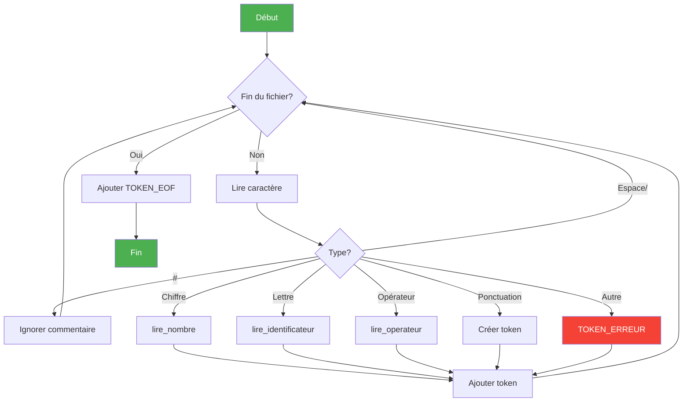

**Pseudo-code :**

```
TANT QUE pas fin du fichier :
    caractère ← lire_caractère()
    
    SI caractère est un espace ou \n :
        ignorer et continuer
    
    SINON SI caractère est '#' :
        ignorer jusqu'à fin de ligne (commentaire)
    
    SINON SI caractère est un chiffre :
        lire_nombre()
    
    SINON SI caractère est une lettre :
        lire_identificateur()
        vérifier si c'est un mot-clé
    
    SINON SI caractère est un opérateur (+, -, *, /, %, etc.) :
        lire_operateur()
        gérer les opérateurs doubles (==, !=, <=, >=)
    
    SINON SI caractère est une ponctuation :
        créer token de ponctuation
    
    SINON :
        créer TOKEN_ERREUR

AJOUTER TOKEN_EOF à la fin
```

**Complexité :** `O(n)` où n = longueur du code source

### 📊 Exemple de Tokenization

**Entrée :**
```galant
variable x = 5;
```

**Processus :**

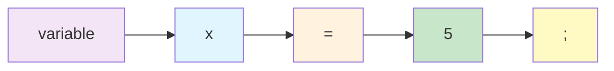

**Sortie (Tokens) :**

| Index | Type | Valeur | Détails |
|-------|------|--------|---------|
| `[0]` | `TOKEN_MOT_CLE` | `"variable"` | KW_VARIABLE |
| `[1]` | `TOKEN_IDENTIFICATEUR` | `"x"` | - |
| `[2]` | `TOKEN_PONCTUATION` | `"="` | - |
| `[3]` | `TOKEN_NOMBRE` | `"5"` | valeur: 5 |
| `[4]` | `TOKEN_PONCTUATION` | `";"` | - |
| `[5]` | `TOKEN_EOF` | `""` | - |

---

## 🌳 Phase 2 : Analyse Syntaxique

### 🎯 Objectif

> Construire un **Arbre de Syntaxe Abstraite (AST)** représentant la structure du programme

### 📁 Fichiers

| Fichier | Rôle |
|---------|------|
| `parser.c` | 🔧 Implémentation |
| `parser.h` | 📋 Interface et structures |

### 🏗️ Structures de Données

#### 1️⃣ ASTNodeType - Types de Nœuds

```c
typedef enum {
    AST_PROGRAMME,       // Nœud racine
    AST_AFFECTATION,     // x = expr
    AST_AFFICHAGE,       // afficher(expr)
    AST_CONDITION,       // si (cond) {...} sinon {...}
    AST_BOUCLE,          // tantque (cond) {...}
    AST_BLOC,            // { instructions }
    AST_EXPRESSION,      // Expression générique
    AST_NOMBRE,          // 42
    AST_VARIABLE,        // x
    AST_OPERATEUR,       // +, -, *, /, %
    AST_CONDITION_EXPR   // ==, !=, >, <, >=, <=
} ASTNodeType;
```

#### 2️⃣ ASTNode - Nœud de l'AST

```c
typedef struct ASTNode {
    ASTNodeType type;              // Type du nœud
    char* valeur;                  // Valeur (nom variable, opérateur)
    int nombre;                    // Valeur numérique
    struct ASTNode** enfants;      // Tableau d'enfants
    int nb_enfants;                // Nombre d'enfants
    int capacite;                  // Capacité du tableau
    struct ASTNode* condition;     // Condition (pour si/tantque)
    struct ASTNode* bloc_si;       // Bloc si vrai
    struct ASTNode* bloc_sinon;    // Bloc si faux
} ASTNode;
```

**Représentation visuelle d'un nœud :**

```
┌──────────────────────────────────────┐
│ ASTNode                              │
├──────────────────────────────────────┤
│ type:      AST_AFFECTATION           │
│ valeur:    "x"                       │
│ enfants[]: [NOMBRE(5)]               │
│ nb_enfants: 1                        │
└──────────────────────────────────────┘
```

### 📖 Grammaire du Langage

#### Notation EBNF

```ebnf
programme        ::= { instruction }

instruction      ::= affectation 
                   | affichage 
                   | condition 
                   | boucle

affectation      ::= "variable" IDENTIFICATEUR ["=" expression] ";"
                   | IDENTIFICATEUR "=" expression ";"

affichage        ::= "afficher" "(" expression ")" ";"

condition        ::= "si" "(" condition_expr ")" bloc 
                     ["sinon" bloc]

boucle           ::= "tantque" "(" condition_expr ")" bloc

bloc             ::= "{" { instruction } "}"

condition_expr   ::= expression operateur_comp expression

expression       ::= terme { ("+" | "-") terme }

terme            ::= facteur { ("*" | "/" | "%") facteur }

facteur          ::= NOMBRE 
                   | IDENTIFICATEUR 
                   | "(" expression ")"

operateur_comp   ::= "==" | "!=" | ">" | "<" | ">=" | "<="
```

### 🎨 Exemple d'AST

**Code :**
```galant
variable x = 5;
si (x > 0) {
  afficher(x);
}
```

**AST Textuel :**
```
PROGRAMME
├── AFFECTATION [x]
│   └── NOMBRE [5] (5)
└── CONDITION
    ├── CONDITION_EXPR [>]
    │   ├── VARIABLE [x]
    │   └── NOMBRE [0] (0)
    └── BLOC
        └── AFFICHAGE
            └── VARIABLE [x]
```

**AST Visuel :**

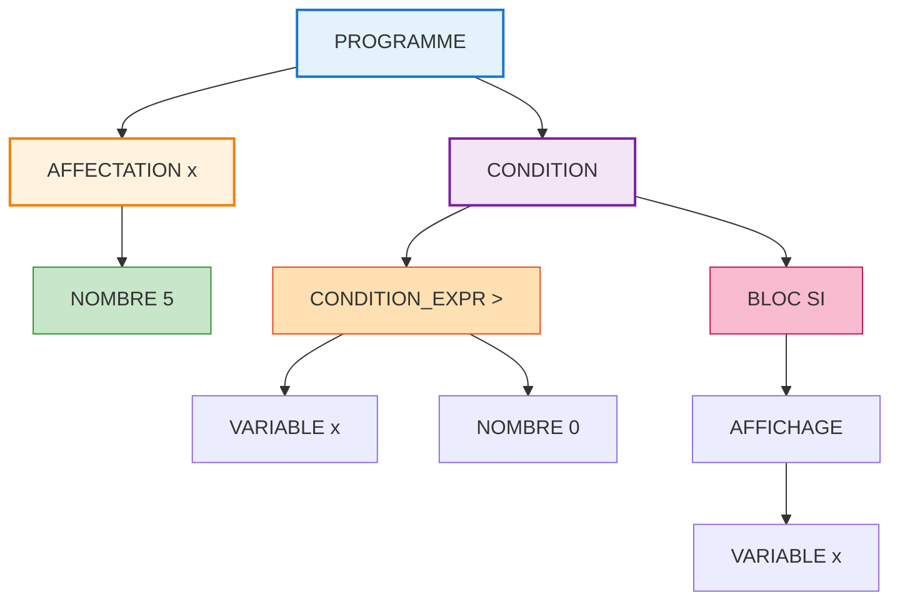

### ⚙️ Algorithme de Parsing

#### Descente Récursive

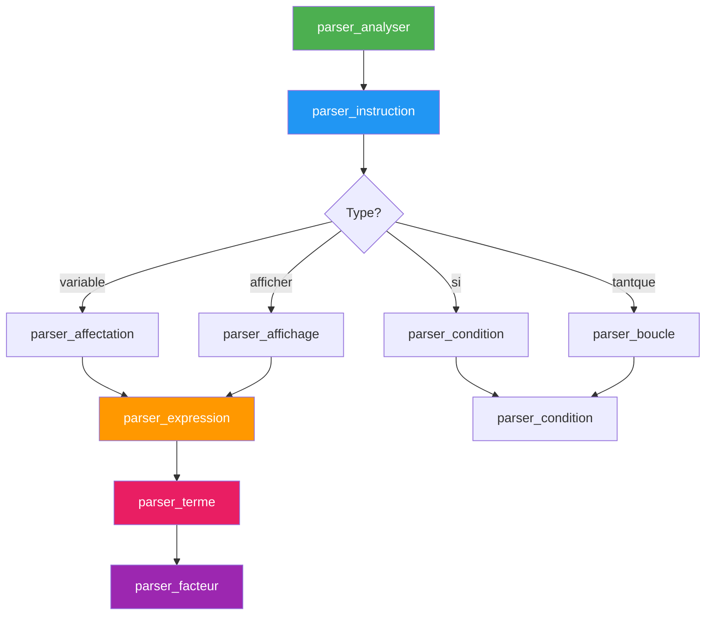

---

## ✅ Phase 3 : Analyse Sémantique

### 🎯 Objectif

> Vérifier la **cohérence sémantique** et **exécuter** le programme

### 📁 Fichiers

| Fichier | Rôle |
|---------|------|
| `semantic.c` | 🔧 Implémentation |
| `semantic.h` | 📋 Interface et structures |

### 🏗️ Structures de Données

#### 1️⃣ Variable

```c
typedef struct {
    char* nom;          // Nom de la variable
    int valeur;         // Valeur actuelle
    int initialise;     // 0 = non initialisée, 1 = initialisée
} Variable;
```

**États d'une variable :**

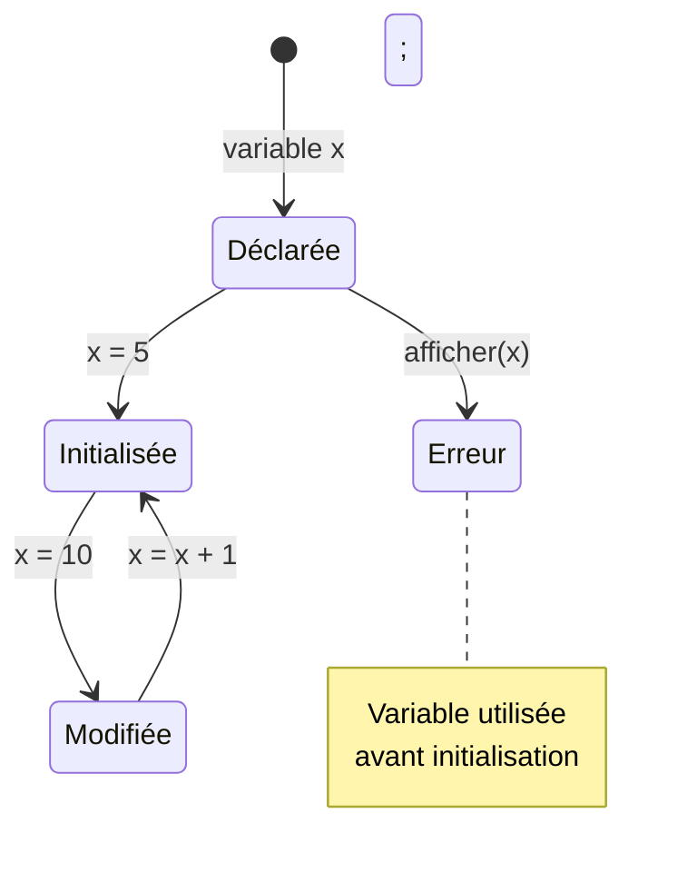

#### 2️⃣ Environnement

```c
#define MAX_VARIABLES 1000

typedef struct {
    Variable variables[MAX_VARIABLES];  // Tableau de variables
    int nb_variables;                   // Nombre de variables
} Environnement;
```

### ⚙️ Fonctions Principales

#### 🔍 Recherche de Variable

```c
Variable* semantic_trouver_variable(Environnement* env, const char* nom)
```

**Algorithme :**
```
POUR chaque variable dans l'environnement :
    SI variable.nom == nom :
        RETOURNER pointeur vers variable
RETOURNER NULL
```

**Complexité :** `O(n)` où n = nombre de variables

**Optimisation possible :** Table de hachage → `O(1)`

#### 📝 Définition de Variable

```c
void semantic_definir_variable(Environnement* env, const char* nom, int valeur)
```

**Flux d'exécution :**

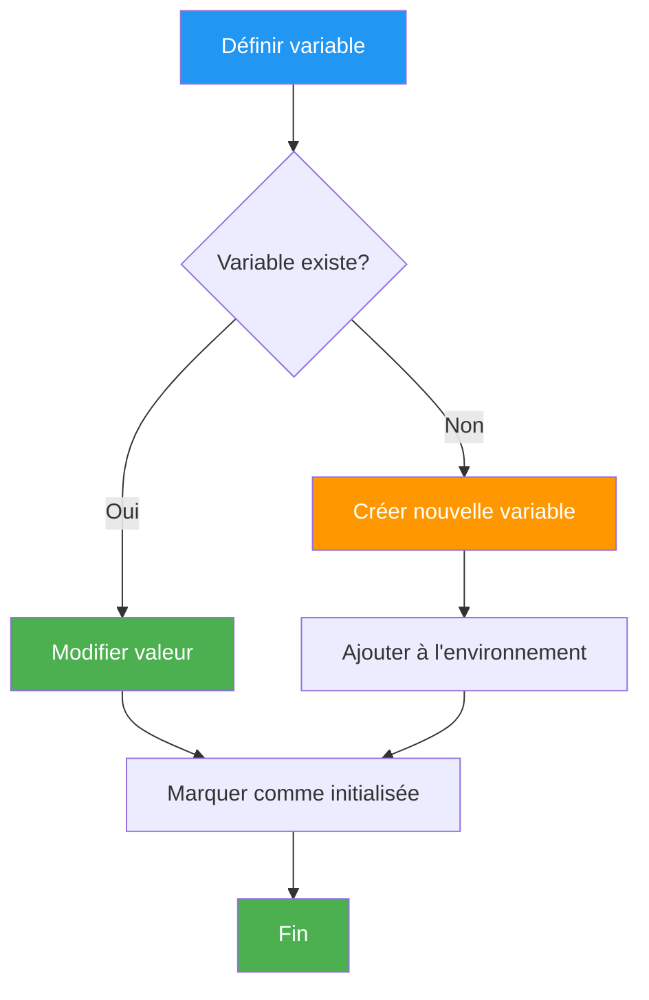

### 🔄 Évaluation d'Expressions

#### Algorithme Récursif

```c
static int evaluer_expression(Environnement* env, ASTNode* node)
```

**Arbre de décision :**

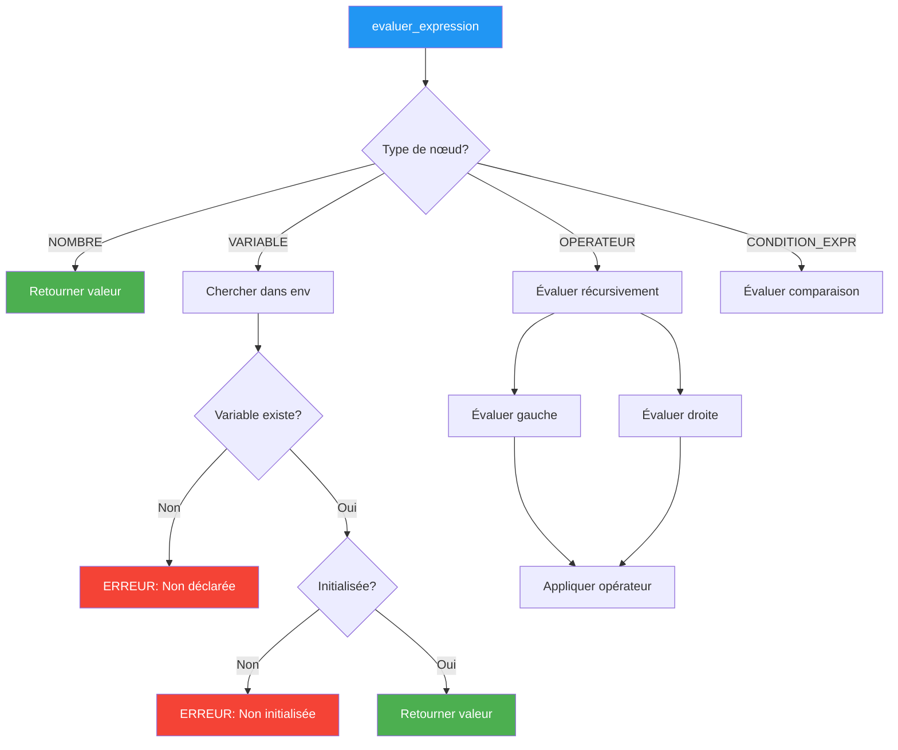

### 🎯 Vérifications Sémantiques

<table>
<tr>
<th>🔍 Vérification</th>
<th>📝 Description</th>
<th>❌ Erreur</th>
</tr>
<tr>
<td><b>Variable Déclarée</b></td>
<td>La variable existe dans l'environnement</td>
<td>

```
variable 'x' non declaree
```

</td>
</tr>
<tr>
<td><b>Variable Initialisée</b></td>
<td>La variable a une valeur assignée</td>
<td>

```
variable 'x' utilisee 
avant initialisation
```

</td>
</tr>
<tr>
<td><b>Division par Zéro</b></td>
<td>Le diviseur n'est pas nul</td>
<td>

```
division par zero
```

</td>
</tr>
<tr>
<td><b>Modulo par Zéro</b></td>
<td>Le modulo n'est pas nul</td>
<td>

```
modulo par zero
```

</td>
</tr>
</table>

---

## 🎯 Module Principal

### 📁 Fichier

- `main.c` - Point d'entrée du compilateur

### 🔄 Flux d'Exécution

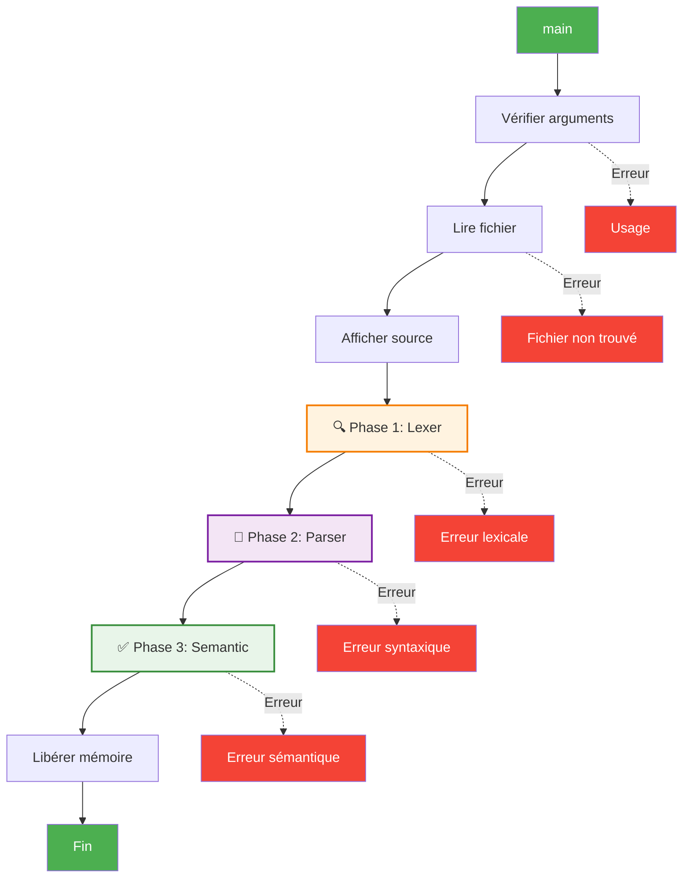

### 📝 Code Principal

```c
int main(int argc, char* argv[]) {
    // 1. Vérification des arguments
    if (argc < 2) {
        fprintf(stderr, "Usage: %s <fichier.gal>\n", argv[0]);
        return 1;
    }

    // 2. Lecture du fichier
    char* source = lire_fichier(argv[1]);

    // 3. Affichage du code source
    printf("=== Code Source ===\n%s\n", source);

    // 4. Phase Lexicale
    Lexer* lexer = lexer_creer(source);
    lexer_analyser(lexer);
    lexer_afficher_tokens(lexer);

    // 5. Phase Syntaxique
    Parser* parser = parser_creer(lexer);
    ASTNode* ast = parser_analyser(parser);
    parser_afficher_ast(ast, 0);

    // 6. Phase Sémantique
    Environnement* env = semantic_creer_env();
    semantic_executer(env, ast);

    // 7. Libération mémoire
    semantic_liberer_env(env);
    parser_liberer_ast(ast);
    parser_liberer(parser);
    lexer_liberer(lexer);
    free(source);
    
    return 0;
}
```

---

## 💾 Gestion Mémoire

### 🎯 Stratégie Générale


### 📊 Par Module

#### 🔍 Lexer

```c
// ✅ Allocation
lexer->tokens = malloc(100 * sizeof(Token));

// 📈 Expansion (doublement de capacité)
if (lexer->nb_tokens >= lexer->capacite) {
    lexer->capacite *= 2;
    lexer->tokens = realloc(lexer->tokens, 
                           lexer->capacite * sizeof(Token));
}

// 🧹 Libération
for (int i = 0; i < lexer->nb_tokens; i++) {
    free(lexer->tokens[i].valeur);
}
free(lexer->tokens);
free(lexer);
```

**Croissance de la capacité :**

```
Capacité initiale: 100
Token 100: ×2 → 200
Token 200: ×2 → 400
Token 400: ×2 → 800
...
```

#### 🌳 Parser

```c
// ✅ Allocation des enfants
node->enfants = malloc(10 * sizeof(ASTNode*));

// 📈 Expansion
if (node->nb_enfants >= node->capacite) {
    node->capacite *= 2;
    node->enfants = realloc(node->enfants, 
                           node->capacite * sizeof(ASTNode*));
}

// 🧹 Libération (récursive)
void parser_liberer_ast(ASTNode* node) {
    if (!node) return;
    
    // Libérer récursivement les enfants
    for (int i = 0; i < node->nb_enfants; i++) {
        parser_liberer_ast(node->enfants[i]);
    }
    
    // Libérer les nœuds spéciaux
    if (node->condition) parser_liberer_ast(node->condition);
    if (node->bloc_si) parser_liberer_ast(node->bloc_si);
    if (node->bloc_sinon) parser_liberer_ast(node->bloc_sinon);
    
    // Libérer le nœud lui-même
    free(node->valeur);
    free(node->enfants);
    free(node);
}
```

#### ✅ Semantic

```c
// ✅ Environnement : tableau fixe
Variable variables[MAX_VARIABLES];

// 🧹 Libération
for (int i = 0; i < env->nb_variables; i++) {
    free(env->variables[i].nom);
}
free(env);
```

### ⚠️ Prévention des Fuites Mémoire

<table>
<tr>
<th>✅ Bonne Pratique</th>
<th>📝 Description</th>
</tr>
<tr>
<td><b>Ordre de libération</b></td>
<td>Libérer les enfants avant les parents (récursif)</td>
</tr>
<tr>
<td><b>Vérification NULL</b></td>
<td>Toujours vérifier avant <code>free()</code></td>
</tr>
<tr>
<td><b>Pas de double free</b></td>
<td>Ne jamais libérer deux fois la même mémoire</td>
</tr>
<tr>
<td><b>Libération complète</b></td>
<td>Libérer tous les pointeurs alloués</td>
</tr>
</table>

---

## 🐛 Gestion des Erreurs

### 📊 Types d'Erreurs

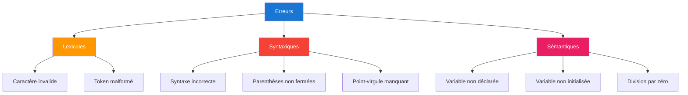

### 🔧 Mécanisme d'Erreur

#### Flag Global

```c
static int error_flag = 0;  // Variable globale statique
```

**États du flag :**

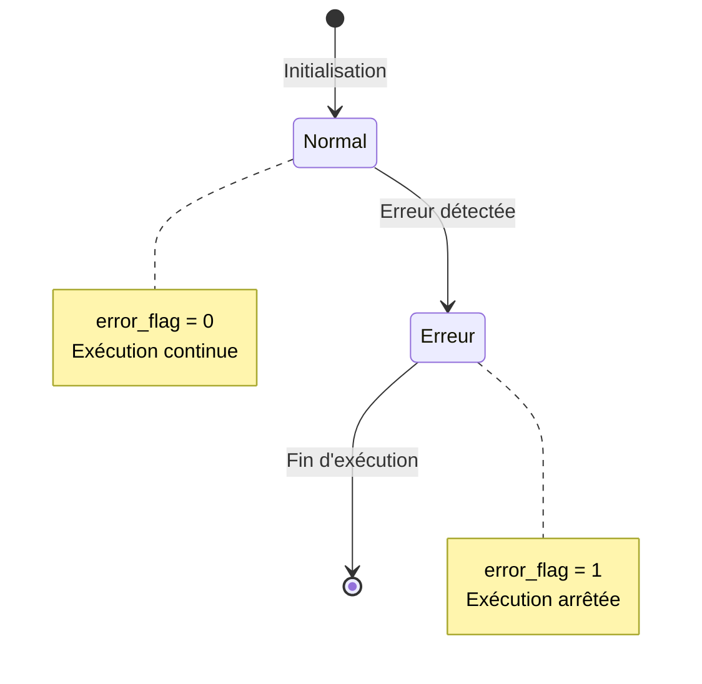

#### Propagation des Erreurs

```c
// ✅ Définir l'erreur
if (condition_erreur) {
    fprintf(stderr, "Erreur: %s\n", message);
    error_flag = 1;
    return;
}

// ✅ Vérifier l'erreur
if (error_flag) return;  // Arrêter l'exécution
```

### 📝 Messages d'Erreur

<table>
<tr>
<th>Type</th>
<th>Message</th>
<th>Action</th>
</tr>
<tr>
<td>🔍 Lexicale</td>
<td><code>Caractère invalide '@' à la ligne 5</code></td>
<td>Corriger le caractère</td>
</tr>
<tr>
<td>🌳 Syntaxique</td>
<td><code>Erreur syntaxique à la ligne 10<br/>Point-virgule attendu</code></td>
<td>Ajouter <code>;</code></td>
</tr>
<tr>
<td>✅ Sémantique</td>
<td><code>Erreur semantique:<br/>variable 'x' non declaree</code></td>
<td>Déclarer la variable</td>
</tr>
</table>

---

## 📊 Complexité et Performance

### 🎯 Analyse de Complexité

| Phase | ⏱️ Temporelle | 💾 Spatiale | 📝 Détails |
|-------|--------------|------------|----------|
| **🔍 Lexer** | `O(n)` | `O(n)` | n = longueur du code |
| **🌳 Parser** | `O(m)` | `O(m)` | m = nombre de tokens |
| **✅ Semantic** | `O(i × d)` | `O(v)` | i = itérations, d = profondeur AST, v = variables |

### 📈 Graphique de Performance

```
Temps d'exécution (ms)
│
│     ╱
│    ╱ Semantic (O(i×d))
│   ╱
│  ╱  Parser (O(m))
│ ╱
│╱ Lexer (O(n))
└──────────────────── Taille du programme
```

### 🚀 Optimisations Possibles

<table>
<tr>
<th>🎯 Optimisation</th>
<th>📊 Gain</th>
<th>💡 Description</th>
</tr>
<tr>
<td><b>Table de hachage</b></td>
<td><code>O(1)</code> au lieu de <code>O(n)</code></td>
<td>Pour la recherche de variables</td>
</tr>
<tr>
<td><b>Pool de mémoire</b></td>
<td>Allocation plus rapide</td>
<td>Pour les nœuds AST</td>
</tr>
<tr>
<td><b>Compilation JIT</b></td>
<td>Exécution plus rapide</td>
<td>Compiler en code machine</td>
</tr>
<tr>
<td><b>Cache d'expressions</b></td>
<td>Éviter recalculs</td>
<td>Pour expressions constantes</td>
</tr>
</table>

### ⚠️ Limitations Actuelles

```
┌─────────────────────────────────────────┐
│ MAX_VARIABLES = 1000                    │
│ → Tableau fixe, pas dynamique           │
├─────────────────────────────────────────┤
│ Recherche linéaire O(n)                 │
│ → Pas de table de hachage               │
├─────────────────────────────────────────┤
│ Pas d'optimisation de l'AST             │
│ → Expressions non simplifiées           │
├─────────────────────────────────────────┤
│ Interprétation pure                     │
│ → Pas de compilation vers code machine  │
└─────────────────────────────────────────┘
```

---

## 🛠️ Technologies Utilisées

<table>
<tr>
<td align="center">

### 📝 Langage


C99 Standard

</td>
<td align="center">

### 🔨 Compilateur


GNU Compiler Collection

</td>
<td align="center">

### ⚙️ Build System


GNU Make

</td>
</tr>
</table>

**Plateformes supportées :**
- 🐧 Linux
- 🪟 Windows (via MinGW/WSL)
- 🍎 macOS

---

## 🎨 Diagrammes de Flux

### 🔄 Cycle de Vie Complet

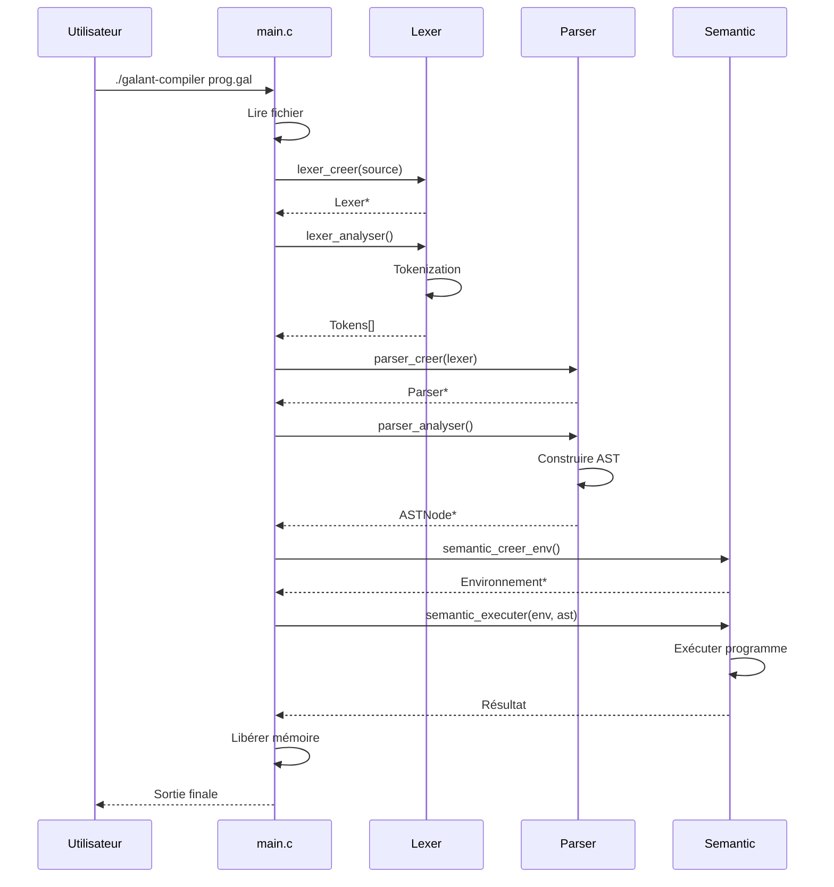

---

## 📚 Ressources

| 📄 Document | 📝 Description |
|------------|---------------|
| [README.md](README.md) | Vue d'ensemble du projet |
| [GUIDE_UTILISATION.md](GUIDE_UTILISATION.md) | Guide utilisateur complet |
| [LICENSE](LICENSE) | Licence MIT |

---

## 🎯 Conclusion

L'architecture de GALANT suit les **principes classiques** de construction de compilateur tout en restant **simple et éducative**. Chaque phase est clairement séparée, facilitant la compréhension et la maintenance.

### 🌟 Points Forts

- ✅ **Modularité** - Séparation claire des responsabilités
- ✅ **Clarté** - Code lisible et bien documenté
- ✅ **Robustesse** - Gestion complète des erreurs
- ✅ **Éducatif** - Idéal pour l'apprentissage

### 🚀 Extensions Possibles

- 📝 Fonctions définies par l'utilisateur
- 📚 Tableaux et structures de données
- 🔗 Opérateurs logiques (ET, OU, NON)
- 💾 Génération de code assembleur
- 🐛 Débogueur intégré

---

<div align="center">

**Documentation technique complète pour GALANT** 🧠

[](README.md)
[](GUIDE_UTILISATION.md)

---

*Fait avec ❤️ pour l'éducation en français* 🇫🇷

</div>
