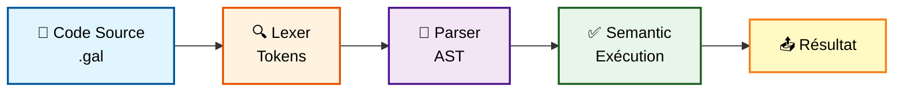

# 🚀 GALANT - Compilateur Éducatif

<div align="center">


[](LICENSE)
[](https://en.wikipedia.org/wiki/C99)
[](Makefile)

**GALANT** = **GA**Le **LAN**guage educa**T**if

*Un compilateur complet en C pour un langage de programmation minimaliste, **entièrement en français** 🇫🇷*

[🎯 Démarrage Rapide](#-installation-rapide) •
[📚 Documentation](#-guide-rapide-du-langage) •
[💡 Exemples](#-exemples-complets) •
[🏗️ Architecture](#️-architecture-du-projet)

</div>

---

## ✨ Caractéristiques

<table>
<tr>
<td width="50%">

### 🇫🇷 Langage Français
- ✅ Syntaxe 100% française
- ✅ Mots-clés en français
- ✅ Messages d'erreur clairs

</td>
<td width="50%">

### 🎓 Éducatif
- ✅ Architecture complète
- ✅ Code modulaire
- ✅ Documentation détaillée

</td>
</tr>
<tr>
<td width="50%">

### 🔧 Fonctionnel
- ✅ Variables et opérateurs
- ✅ Conditions et boucles
- ✅ Gestion d'erreurs

</td>
<td width="50%">

### 📦 Simple
- ✅ Extension `.gal`
- ✅ Compilation rapide
- ✅ Utilisation intuitive

</td>
</tr>
</table>

---

## 🚀 Installation Rapide

### 📋 Prérequis

```bash
# Vérifier GCC
gcc --version

# Vérifier Make
make --version
```

<details>
<summary>💻 Installation de GCC (cliquez pour développer)</summary>

**Linux (Ubuntu/Debian)**
```bash
sudo apt-get update
sudo apt-get install build-essential
```

**macOS**
```bash
xcode-select --install
```

**Windows**
```bash
# Installez MinGW ou utilisez WSL
```
</details>

### ⚡ Compilation

```bash
# 1️⃣ Cloner le projet
git clone <votre-repo>
cd GALANT

# 2️⃣ Compiler
make

# 3️⃣ Vérifier
ls -la galant-compiler
```

**Sortie attendue :**
```
✓ Compile: main.c
✓ Compile: lexer.c
✓ Compile: parser.c
✓ Compile: semantic.c
✓ Compilation reussie. Executable: galant-compiler
```

### 🎮 Première Exécution

```bash
# Exécuter le programme exemple
./galant-compiler programme.gal

# Ou utiliser Make
make run
```

---

## 📖 Guide Rapide du Langage

### 🔤 Variables

```galant
variable x = 5;          # ✅ Déclaration avec initialisation
variable nom = 10;       # ✅ Nom explicite
variable y;              # ⚠️ Déclaration sans initialisation
x = 20;                  # ✅ Réaffectation
```

| ✅ Autorisé | ❌ Interdit |
|------------|------------|
| `variable_1` | `1variable` |
| `mon_nombre` | `mon-nombre` |
| `_valeur` | `variable` (mot-clé) |
| `COMPTEUR` | `mon nombre` (espace) |

### 🖨️ Affichage

```galant
afficher(x);             # Affiche: 5
afficher(y + 3);         # Affiche: 23
afficher(42);            # Affiche: 42
```

### ➕ Opérateurs Arithmétiques

<table>
<tr>
<th>Opérateur</th>
<th>Description</th>
<th>Exemple</th>
<th>Résultat</th>
</tr>
<tr>
<td align="center"><code>+</code></td>
<td>Addition</td>
<td><code>10 + 3</code></td>
<td><code>13</code></td>
</tr>
<tr>
<td align="center"><code>-</code></td>
<td>Soustraction</td>
<td><code>10 - 3</code></td>
<td><code>7</code></td>
</tr>
<tr>
<td align="center"><code>*</code></td>
<td>Multiplication</td>
<td><code>10 * 3</code></td>
<td><code>30</code></td>
</tr>
<tr>
<td align="center"><code>/</code></td>
<td>Division entière</td>
<td><code>10 / 3</code></td>
<td><code>3</code></td>
</tr>
<tr>
<td align="center"><code>%</code></td>
<td>Modulo (reste)</td>
<td><code>10 % 3</code></td>
<td><code>1</code></td>
</tr>
</table>

### 🔀 Conditions

```galant
si (age >= 18) {
  afficher(1);           # Majeur
} sinon {
  afficher(0);           # Mineur
}
```

**Opérateurs de comparaison :**

| Opérateur | Signification | Exemple |
|:---------:|---------------|---------|
| `==` | Égal | `x == 10` |
| `!=` | Différent | `x != 5` |
| `>` | Supérieur | `x > 0` |
| `<` | Inférieur | `x < 100` |
| `>=` | Supérieur ou égal | `x >= 18` |
| `<=` | Inférieur ou égal | `x <= 99` |

### 🔁 Boucles

```galant
variable i = 0;

tantque (i < 5) {
  afficher(i);
  i = i + 1;
}
# Affiche : 0, 1, 2, 3, 4
```

### 💬 Commentaires

```galant
# Commentaire sur une seule ligne
variable x = 10;         # Commentaire en fin de ligne

# =====================================
# Bloc de commentaires
# Documentation du code
# =====================================
```

---

## 💡 Exemples Complets

### 📊 Exemple 1 : Compteur Simple

<details>
<summary>👁️ Voir le code</summary>

**Fichier : `exemple1.gal`**

```galant
# Affiche les nombres de 0 à 4
variable i = 0;

tantque (i < 5) {
  afficher(i);
  i = i + 1;
}
```

**📤 Sortie :**
```
0
1
2
3
4
```
</details>

### 🧮 Exemple 2 : Factorielle

<details>
<summary>👁️ Voir le code</summary>

**Fichier : `exemple2.gal`**

```galant
# Calcul de 5! (factorielle)
variable n = 5;
variable resultat = 1;
variable i = 1;

tantque (i <= n) {
  resultat = resultat * i;
  i = i + 1;
}

afficher(resultat);
```

**📤 Sortie :**
```
120
```
</details>

### 🔢 Exemple 3 : Nombres Pairs

<details>
<summary>👁️ Voir le code</summary>

**Fichier : `exemple3.gal`**

```galant
# Affiche les nombres pairs de 0 à 10
variable x = 0;

tantque (x <= 10) {
  si (x % 2 == 0) {
    afficher(x);
  }
  x = x + 1;
}
```

**📤 Sortie :**
```
0
2
4
6
8
10
```
</details>

### 📈 Exemple 4 : Fibonacci

<details>
<summary>👁️ Voir le code</summary>

**Fichier : `fibonacci.gal`**

```galant
# Suite de Fibonacci (10 premiers nombres)
variable n = 10;
variable i = 0;
variable a = 0;
variable b = 1;
variable temp = 0;

tantque (i < n) {
  afficher(a);
  temp = a + b;
  a = b;
  b = temp;
  i = i + 1;
}
```

**📤 Sortie :**
```
0, 1, 1, 2, 3, 5, 8, 13, 21, 34
```
</details>

---

## 🏗️ Architecture du Projet

```
📁 GALANT/
├── 📄 main.c              # Point d'entrée
├── 📄 lexer.c / lexer.h   # 🔍 Analyse lexicale
├── 📄 parser.c / parser.h # 🌳 Analyse syntaxique
├── 📄 semantic.c / semantic.h # ✅ Analyse sémantique
├── 📄 Makefile            # ⚙️ Configuration build
├── 📖 README.md           # Documentation principale
├── 📚 GUIDE_UTILISATION.md # Guide complet
├── 📐 ARCHITECTURE.md     # Documentation technique
├── 📝 programme.gal       # Programme exemple
└── 📝 exemple2.gal        # Exemple factorielle
```

### 🔄 Pipeline de Compilation



### 📊 Phases de Compilation

| Phase | Module | Entrée | Sortie |
|-------|--------|--------|--------|
| 🔍 **Lexicale** | `lexer.c` | Code source | Tokens |
| 🌳 **Syntaxique** | `parser.c` | Tokens | AST |
| ✅ **Sémantique** | `semantic.c` | AST | Exécution |

---

## 🎯 Mots-Clés du Langage

<table>
<tr>
<th>Mot-clé</th>
<th>Description</th>
<th>Exemple</th>
</tr>
<tr>
<td><code>variable</code></td>
<td>Déclarer une variable</td>
<td><code>variable x = 5;</code></td>
</tr>
<tr>
<td><code>afficher</code></td>
<td>Afficher une valeur</td>
<td><code>afficher(x);</code></td>
</tr>
<tr>
<td><code>si</code></td>
<td>Condition IF</td>
<td><code>si (x > 0) { }</code></td>
</tr>
<tr>
<td><code>sinon</code></td>
<td>Condition ELSE</td>
<td><code>sinon { }</code></td>
</tr>
<tr>
<td><code>tantque</code></td>
<td>Boucle WHILE</td>
<td><code>tantque (x < 10) { }</code></td>
</tr>
</table>

---

## ⚙️ Commandes Make

```bash
make              # 🔨 Compiler le projet
make clean        # 🧹 Nettoyer les fichiers compilés
make run          # ▶️ Compiler et exécuter programme.gal
make help         # ❓ Afficher l'aide
```

---

## 📊 Sortie du Compilateur

### 1️⃣ Code Source
```
=== Code Source ===
variable x = 5;
afficher(x);
```

### 2️⃣ Analyse Lexicale
```
=== Analyse Lexicale ===
[  0] MOT_CLE         = 'variable' (mot-cle: VARIABLE)
[  1] IDENTIFICATEUR  = 'x'
[  2] PONCTUATION     = '='
[  3] NOMBRE          = '5' (valeur: 5)
[  4] PONCTUATION     = ';'
```

### 3️⃣ Arbre de Syntaxe Abstraite
```
=== Analyse Syntaxique (AST) ===
PROGRAMME
  AFFECTATION [x]
    NOMBRE [5] (5)
  AFFICHAGE
    VARIABLE [x]
```

### 4️⃣ Exécution
```
=== Execution ===
5
```

---

## 🐛 Gestion des Erreurs

### Types d'Erreurs

| 🔴 Type | 📍 Phase | 💡 Exemple |
|---------|----------|-----------|
| Lexicale | Lexer | Caractère invalide `@` |
| Syntaxique | Parser | `variable x` (manque `;`) |
| Sémantique | Semantic | Variable non déclarée |

### Messages d'Erreur Courants

<details>
<summary>❌ Variable non déclarée</summary>

```
Erreur semantique: variable 'x' non declaree
```

**Solution :**
```galant
variable x = 5;  # Déclarer avant utilisation
afficher(x);
```
</details>

<details>
<summary>❌ Variable non initialisée</summary>

```
Erreur semantique: variable 'x' utilisee avant initialisation
```

**Solution :**
```galant
variable x = 0;  # Initialiser avec une valeur
afficher(x);
```
</details>

<details>
<summary>❌ Division par zéro</summary>

```
Erreur semantique: division par zero
```

**Solution :**
```galant
si (diviseur != 0) {
  variable resultat = 10 / diviseur;
  afficher(resultat);
}
```
</details>

---

## 📚 Documentation Complète

| 📄 Document | 📝 Description |
|------------|---------------|
| [README.md](README.md) | Vue d'ensemble du projet |
| [GUIDE_UTILISATION.md](GUIDE_UTILISATION.md) | Guide utilisateur complet |
| [ARCHITECTURE.md](ARCHITECTURE.md) | Documentation technique |
| [LICENSE](LICENSE) | Licence MIT |

---

## 🎓 Utilisation Éducative

### Objectifs Pédagogiques

- 🧠 **Comprendre** les phases de compilation
- 🔬 **Expérimenter** avec un vrai compilateur
- 📊 **Apprendre** les structures de données
- 🎯 **Découvrir** l'analyse sémantique

### Pour Qui ?

| 👥 Public | 📈 Niveau |
|-----------|----------|
| 🎓 Étudiants en informatique | Intermédiaire |
| 👨‍🏫 Enseignants | Tous niveaux |
| 🧑‍💻 Développeurs curieux | Débutant → Avancé |
| 🔍 Chercheurs en compilation | Avancé |

---

## 🚀 Fonctionnalités Futures

- [ ] 🔧 Support des fonctions
- [ ] 📚 Tableaux
- [ ] 📝 Chaînes de caractères
- [ ] 🔗 Opérateurs logiques (`et`, `ou`, `non`)
- [ ] 🔄 Boucle `pour`
- [ ] 💾 Génération de code assembleur
- [ ] 🐛 Débogueur intégré

---

## 🤝 Contribution

Les contributions sont les bienvenues ! 

### Comment Contribuer ?

1. 🍴 Fork le projet
2. 🌿 Créer une branche (`git checkout -b feature/AmazingFeature`)
3. 💾 Commit vos changements (`git commit -m 'Add AmazingFeature'`)
4. 📤 Push vers la branche (`git push origin feature/AmazingFeature`)
5. 🔃 Ouvrir une Pull Request

---

## 📞 Support

### Besoin d'Aide ?

1. 📖 Consultez [GUIDE_UTILISATION.md](GUIDE_UTILISATION.md)
2. 🏗️ Vérifiez [ARCHITECTURE.md](ARCHITECTURE.md)
3. 🐛 Ouvrez une [Issue](https://github.com/votre-repo/issues)

---

## 📜 Licence

Ce projet est sous licence MIT. Voir le fichier [LICENSE](LICENSE) pour plus de détails.

```
MIT License - Copyright (c) 2025 Yahia Achouri
```

---

## 🌟 Remerciements

Merci à tous les contributeurs et utilisateurs de GALANT !

---

<div align="center">

**Fait avec ❤️ pour l'éducation en français**

[⬆️ Retour en haut](#-galant---compilateur-éducatif)

</div>
